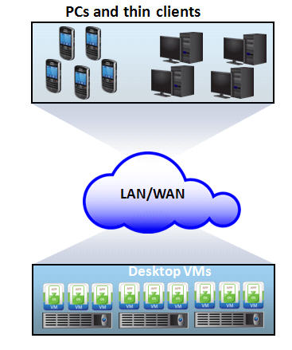
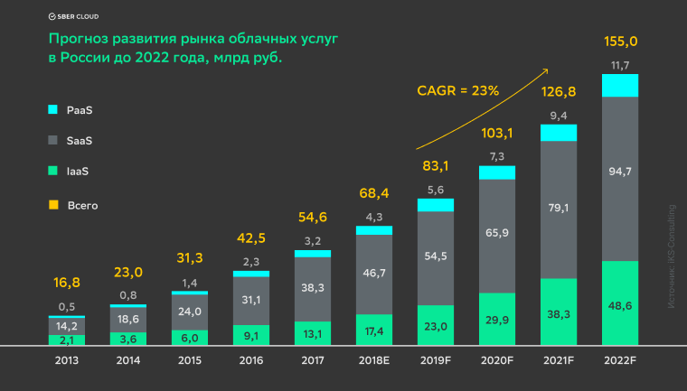
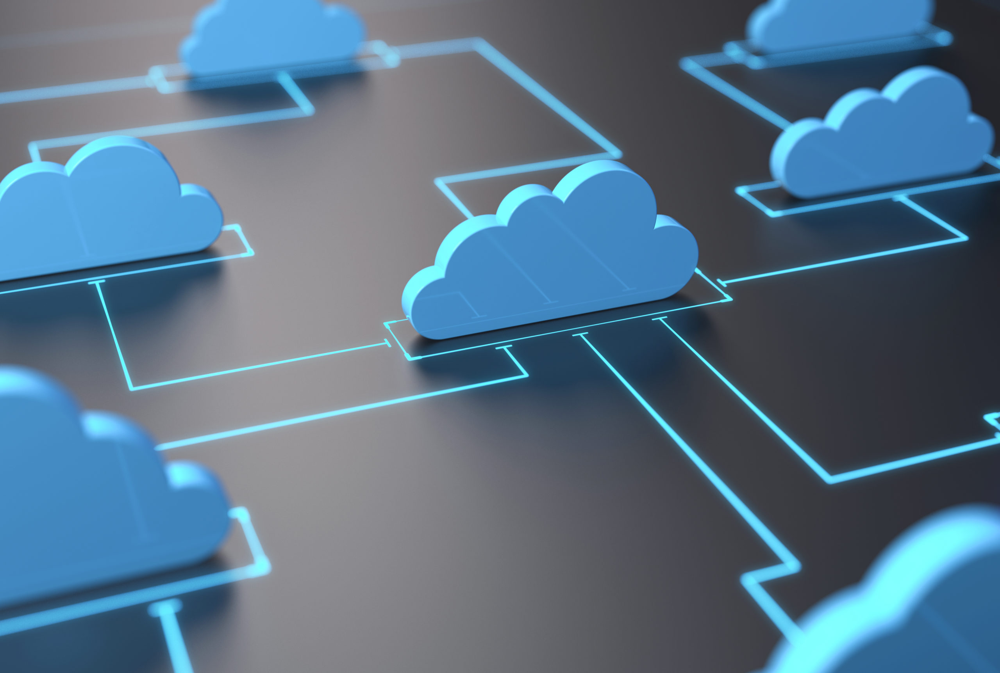

## Виртуализация рабочей станции и приложений
Виртуализация рабочей станции и приложений

Виртуализация рабочей станции – это технология, реализующая разделение состояния пользователя, операционной системы и приложений от конечных устройств

Виртуализация приложений – это техника предоставления приложения конечному пользователю без установки, интеграции или зависимостей от компьютерной платформы

---

## Обзор виртуализации рабочей станции и приложений
Обзор виртуализации рабочей станции и приложений

---

## Виртуализация рабочей станции
Позволяет организациям размещать и централизованно управлять рабочими станциями

Рабочие станции запускаются как виртуальные машины в рамках VDC

Могу быть доступны через LAN/WAN

Конечными устройствами могут быть тонкие клиенты или ПК

Виртуализация рабочей станции

---

## Преимущества виртуализации рабочей станции
Преимущества виртуализации рабочей станции

Возможность использования тонких клиентов

Улучшенная безопасность данных

Упрощенная процедура бэкапа

Упрощенная поддержка ПК

Гибкость доступа

---

Виртуализация рабочей станции - предпосылки

Проблемы, связанные с управлением

Разнообразие аппаратных компонент, обновление цикла работы ПО, несовместимость на аппаратном уровне

Проблемы, связанные с безопасностью

Потеря ноутбука/рабочей станции

Проблемы стоимости

---

## Техники виртуализации рабочей станции
Техники виртуализации рабочей станции

Техника 1: Remote Desktop Services(RDS)

Техника 2: Virtual Desktop Infrastructure (VDI)

Техники виртуализации рабочей станции предоставляют возможность централизованно размещать и управлять окружением рабочих станций

Удаленно предоставлять к ним доступ с пользовательских конечных устройств

---

## Remote Desktop Services
Remote Desktop Services

RDS также известна как «терминальные службы»

Терминальные службы запускаются на верхнем уровне установки Windows

Обеспечивают индивидуальные сессии для клиентских систем

Клиент получает внешний вид рабочей станции

Потребление ресурсов происходит на сервере

---

## Преимущества Remote Desktop Services
Преимущества Remote Desktop Services

Быстрая «доставка» приложений

Приложения устанавливаются на сервере. Доступ к ним также осуществляется от сервера

Улучшенная безопасность

Приложения и данные сохраняются на сервере

Централизованное управление

Низкая стоимость технологии по сравнению с VDI

---

## Virtual Desktop Infrastructure(VDI)
Virtual Desktop Infrastructure(VDI)

VDI предполагает размещение рабочей станции, которая работает в рамках VM на сервере в VDC

Каждая рабочая станция обладает собственной ОС и установленными приложениями

Пользователь обладает полным доступом к ресурсам виртуализованной рабочей станции

---

## VDI: компоненты
VDI: компоненты

Конечные устройства

VM для размещения/серверы для выполнения задач

Посредник соединений (Connection Broker)

---

## Серверы размещения VM (VM hosting servers)
Серверы размещения VM (VM hosting servers)

Серверы размещения VM ответственны за размещение виртуальных машин рабочих станций

Удаленно доставляемых на конечные устройства

Каждая виртуальная машина может быть закреплена за определенным пользователем или выделена в пул

Пул VM предоставляет разделяемый доступ к VM для параллельного использования несколькими пользователями

При предоставлении виртуальных машин шаблон или образ может использоваться как основа для создания виртуальной машины, настроек и конфигурации диска

---

## Посредник соединений (Connection Broker)
Посредник соединений (Connection Broker)

Отвечает за установление и управление соединениями между конечным устройством и рабочей станицей виртуальной машины

Посредник соединений

(Connection Broker)

---

## VDI: преимущества и проблемы
VDI: преимущества и проблемы

Проблемы

Зависимость от сетевого соединения

Не подходит для сложных графических приложений

Требует дополнительной инфраструктуры

Преимущества

Централизованное развертывание и управление

Улучшенная безопасность

Улучшенная непрерывность работы бизнеса и восстановление после катастроф

---

## Виртуализация состояния пользователя
Виртуализация состояния пользователя

Состояние пользователя включает в себя пользовательские данные вместе с настройками приложений и конфигурацией ОС

Виртуализация состояния пользователя сохраняет пользовательские данные и настройки в центральной локации

Преимущества виртуализации состояния пользователя:

Упрощенная миграция состояния пользователя в рамках обновления/миграции операционной системы

Данные становятся доступны независимо от расположения конечного устройства

---

## Виртуализация приложений
Виртуализация приложений

Позволяет приложению предоставляться в изолированном окружении

Ресурсы операционной системы и приложение агрегированы в виртуализованный контейнер

Гарантирует целостность операционной системы и приложений

Избегаются конфликты между различными приложениями или различными версиями одного и того же приложения

---

## Виртуализация приложений: методы развертывания
Виртуализация приложений: методы развертывания

Инкапсуляция приложений

Приложение конвертировано в self-contained пакет

Нет зависимости от установки ПО и операционной системы

Пакет приложений может развертываться с использованием USB, CD-ROM, или локального диска

Встроенные агенты поставляются в рамках приложений

Потоковая трансляция приложений (Application Streaming)

Специфические данные/ресурсы приложения передаются клиентскому устройству в момент выполнения приложения

Клиенту предоставляется минимальное количество данных (обычно 10%-30% общего размера приложения)

Перед запуском приложения

Дополнительные функции приложения предоставляются по запросу

Для запуска виртуализованного приложения необходимы локально установленные агенты

---

## Упрощенное развертывание/свертывание приложения
Преимущества виртуализации приложения

Упрощенное развертывание/свертывание приложения

Приложения не устанавливаются

Упрощенное управление образами операционной системы

Приложения полностью отделены от операционной системы

Патчи и обновления ОС не влияют на приложения

Исключение конфликтов ресурсов

Приложения обладают собственными виртуальными ресурсами ОС

---

## Облако
Облачные вычисления (Cloud computing)

Трансформация классического ЦОД в облако предполагает наличие уровня управления облачными сервисами, который находится на верхнем уровне VDC

Облако

---

Развитие рынка облачных услуг

---

## Облачные вычисления – это модель представления широкого доступа по сети к общему пулу вычислительных ресурсов по требованию. Эти ресурсы оперативно занимаются и освобождаются при минимальных усилиях со стороны заказчика на органах управления и взаимодействия с поставщиками услуг.
Определение

Облачные вычисления – это модель представления широкого доступа по сети к общему пулу вычислительных ресурсов по требованию. Эти ресурсы оперативно занимаются и освобождаются при минимальных усилиях со стороны заказчика на органах управления и взаимодействия с поставщиками услуг.

---

## Требования бизнеса
Предпосылки для появления облачных вычислений

Требования бизнеса

Трансформация бизнес процессов с целью получения лучшего результата при меньших затратах

Гибкость и доступность по сокращенной цене

Сокращение времени  выхода на рынок

Увеличиваемая скорость инноваций

IT вызовами, связанными с соответствием бизнес требованиям являются:

Обслуживание заказчиков круглосуточно по всему миру, быстрое обновление технологий, быстрое предоставление IT ресурсов по сокращенной цене

Эти вызовы решаются с появлением облачных вычислений

---

## Экономика облака
Экономика облака

Облачные технологии изменили экономику IT

Облако позволяет двигаться от модели CAPEX (Капитальные расходы) к модели OPEX (Операционные расходы)

Облако позволяет снизить ключевые затраты

Затраты на инфраструктуру

Затраты на управление

Затраты мощностей и энергии

---

## Безопасность и регуляция
Безопасность и регуляция

Потребители не решаются передавать контроль за критически важными данными

Регуляторы могут запрещать организациям использовать облачные сервисы

Задержки сети

Приложения реального времени могут пострадать от задержек сети и ограничений пропускной способности

Поддержка

Уже имеющиеся, устаревающие или обладающие специфическими настройками приложения пользователя не могут работать с облачными платформами

Оперативность

Отсутствие стандартов для облачных платформ

Проблемы облачной инфраструктуры – взгляд потребителя

---

## Гарантия и стоимость услуг
Проблемы облачной инфраструктуры – взгляд провайдера

Гарантия и стоимость услуг

Ресурсы должны быть готовы к непредвиденному скачку в запросах

Тяжелые штрафы в случае не соответствия соглашению об уровне оказания услуг (SLA)

Управление большим количеством оборудования

Большое количество приложений и платформ

Непрогнозируемый возврат инвестиций (Return of Investments (ROI))

Отсутствие стандартов для интерфейсов доступа к облаку

Потребители облачных услуг хотят видеть открытые API

Необходимо соглашение между провайдерами облачных услуг для стандартизации

---

## Проблемы перехода с вЦОД на «облака»:
Путь к «облакам»

Проблемы перехода с вЦОД на «облака»:

высокая стоимость решений

сложности интеграции с публичными «облаками» для создания гибридного «облака»

ограниченная масштабируемость

невозможность быстрой реконфигурации

---

## Основные понятия, раскрытые в данной лекции:
Итоги

Основные понятия, раскрытые в данной лекции:

Виртуализация рабочей станции

Виртуализация приложения

Основания перехода к облаку

---

