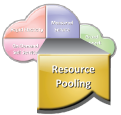
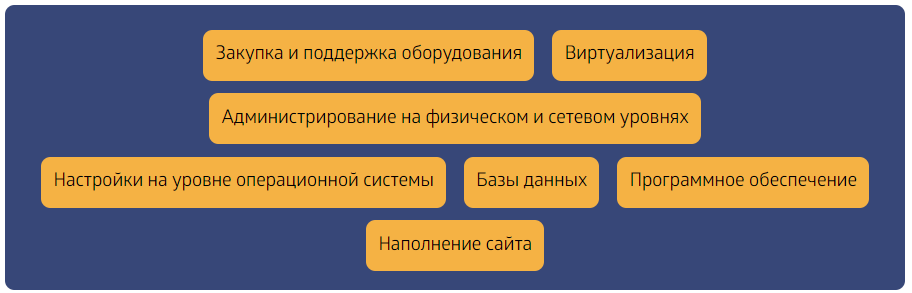

## Облако
Облачные вычисления (Cloud computing)

Трансформация классического ЦОД в облако предполагает наличие уровня управления облачными сервисами, который находится на верхнем уровне VDC

Облако

---

## Облачные вычисления: характеристики
Облачные вычисления: характеристики

---

## Предоставление вычислительных мощностей незамедлительно, по запросу,  с целью удовлетворения динамично меняющихся потребностей без перерывов в оказании услуг
Быстрая гибкая реакция на требования пользователей (Rapid elasticity)

Предоставление вычислительных мощностей незамедлительно, по запросу,  с целью удовлетворения динамично меняющихся потребностей без перерывов в оказании услуг

Ресурсы могут динамично повышаться и снижаться

Пользователи видят перспективы развития облака

Пользователь может начать с минимальной вычислительной мощности и расширять  инфраструктуру до любого размера

---

## Измеряемые сервисы (Measured Service)
Измеряемые сервисы (Measured Service)

Пользователи получают счет на основе измеренного использования облачных ресурсов

Затраты вычисляются на базе оплаты за использование (pay-per-use)

Модель ценообразования составляется в соответствии с запрашиваемыми уровнями услуг

Постоянный мониторинг потребления ресурсов делает прозрачными расчеты и информацию об используемом сервисе как для компании, предоставляющей облачные технологии, так и для пользователей

---

## Доступ к вычислительным мощностям осуществляется по сети, обычно по сети интернет, с использованием различных клиентских платформ:
Ширококанальный доступ по сети (Broad Network Access)

Доступ к вычислительным мощностям осуществляется по сети, обычно по сети интернет, с использованием различных клиентских платформ:

Десктопы

Ноутбуки

Планшеты

Мобильные устройства

Удовлетворяет потребность доступа определенной клиентской платформы к сервису

Предоставляет доступ к сервису из любого места

---

## IT ресурсы (вычисления, хранение, сеть) группируются в пул с целью обслуживания нескольких пользователей
Пулинг ресурсов (Resource Pooling)

IT ресурсы (вычисления, хранение, сеть) группируются в пул с целью обслуживания нескольких пользователей

На основе принципа мультиарендности (multi-tenant model)

Ресурсы выделяются из пула в соответствии с запросами потребителей

Потребители не обладают контролем над ресурсами, а также знанием их физического расположения

---

## Позволяет при необходимости в одностороннем  порядке автоматически предоставлять потребителям вычислительные мощности
Самообслуживание по запросу (On-demand self-service)

Позволяет при необходимости в одностороннем  порядке автоматически предоставлять потребителям вычислительные мощности

Потребители видят сервисный каталог как web-based пользовательский интерфейс и используют его для запрашивания ресурсов

Позволяет запрашивать ресурсы, используя интерфейс самообслуживания

Потребительский интерфейс должен быть удобен в использовании

---

## Примеры предложений облачных услуг
Примеры предложений облачных услуг

---

## Модели облачных услуг
Модели облачных услуг

Облачные услуги делятся на три основных категории:

Инфраструктура как услуга (Infrastructure-as-a-Service (IaaS))

Платформа как услуга (Platform-as-a-Service (PaaS))

Программное обеспечение как услуга (Software-as-a-Service (SaaS))

---

## Три модели облачных сервисов
Три модели облачных сервисов

Облака не появились одномоментно. Как любое явление в природе, как любое человеческое изобретение, облачные технологии прошли несколько стадий развития, предваряли которые создание интернета и открытие технологии виртуализации. Эти стадии сейчас превратились в равноправные сервисные модели, в рамках которых реализуются облачные услуги

---

## Три модели облачных сервисов
Три модели облачных сервисов

Модель IaaS

Первая модель облачного сервиса – это Infrastructure-as-a-Service(IaaS). При помощи данной модели пользователь сможет удалённо использовать какую-либо информацию из облака, у которой есть возможность ежеминутного или даже ежесекундного изменения. При помощи данной технологии у компании есть возможность устанавливать свои бизнес-приложения либо даже специальные ПО на облако. Всё остальное, поддержку и управление, будет обеспечивать провайдер.

---

Предоставляет возможность провайдерам контролировать компоненты инфраструктуры, такие как серверы, хранение и сеть

Потребители контролируют свое ПО и развернутые приложения

Оплата за использование компонентов инфраструктуры, например, потребляемое дисковое пространство (Storage capacity), загруженность процессора (CPU usage), и т.д.

Инфраструктура как услуга IaaS (Infrastructure-as-a-Service)

---

## Примеры IaaS
Amazon Elastic Cloud Computing (EC2) является моделью IaaS, которая обеспечивает вычислительные мощности на базе оплаты за использование

Позволяет пользователям арендовать виртуальное вычислительное устройство (compute), при помощи которого он может создать собственное приложение

EMC Atmos Online предоставляет хранение данных как услугу

Хранение по запросу, с доступом в интернет

Примеры IaaS

---

## Три модели облачных сервисов
Три модели облачных сервисов

Модель PaaS

Вторая модель облачного сервиса – это Plаtform-as-a-Service (PaаS). Данная модель предназначена для обеспечения вычислений на облаке, к которому пользователь сможет получить доступ для использования технологически-информационных баз, таких как операционные системы, различного рода СУБД, средства произведения и тестирования ПО и другие. Данная модель и вся её технологически-информационная инфраструктура, в том числе и сети для вычисления, сервера, базы хранения, подчиняется полностью провайдеру и им же управляется. Также сайт облачного сервиса определяет количество разрешенных потребителям видов платформы.

---

## Пользователь
Пользователи разворачивают созданные ими или приобретенные приложения на вычислительной платформе провайдера

Пользователи контролируют

Развернутое приложение

Возможные конфигурации приложения

Пользователи оплачивают компоненты платформы

ОС, База данных, связующее программное обеспечение

Платформа как услуга PaaS (Platform-as-a-Service)

Пользователь

Ресурсы провайдера

Приложения

Базы данных

Вычисления

Хранение

Сеть

---

## Примеры PaaS
Google App Engine предоставляет потребителю платформу для развертывания или создания собственных приложений

Динамичное перемещение системных ресурсов для приложения на основе текущего потребления

Предоставляет инфраструктуры Java и Python для того, чтобы создавать и развертывать приложения

Платформа Microsoft Azure предоставляет различные функции для построения приложений

Использует существующие способности при помощи Visual Studio и .Net для построения приложений

Также создает приложения при помощи Java и PHP, используя Eclipse и другие инструменты

Примеры PaaS

---

## Три модели облачных сервисов
Три модели облачных сервисов

Модель SaaS

Третья модель облачного сервиса – это Stоrage-as-a-Servise (SaaS). Данная модель является наиболее простой в CС-сервисах, которые представляют собою дисковые пространства по запросам пользователя. Наверное, каждый человек встречался с такой надписью на мониторе, когда диск был переполнен, и для дальнейшей работы нужно было освободить место на логическом диске. При помощи данной модели облачного сервиса пользователь может сохранять различные данные на облаке, то есть на внешнем хранилище. В компьютере оно будет иметь вид обычного логического диска либо папки. Данный сервис является основополагающим и самым главным для всех остальных, так как он входит почти в каждый из них.

---

## Потребители используют приложения провайдера,  запущенные в облачной инфраструктуре
Потребители используют приложения провайдера,  запущенные в облачной инфраструктуре

Полный стэк, включая приложение, предоставляется как услуга

Приложения доступны с различных клиентских платформ, например, при помощи web браузера

Оплата зависит от использования приложения

Программное обеспечение как услуга SaaS (Software-as-a-Service)

Пользователь

Ресурсы провайдера

Приложения

Базы данных

Вычисления

Хранение

Сеть

---

## EMC Mozy является моделью SaaS для онлайн бэкапа:
EMC Mozy является моделью SaaS для онлайн бэкапа:

Пользователи могут использовать консоль Mozy для достижения автоматического, безопасного онлайн бэкапа и восстановления данных

Salesforce.com является моделью SaaS для приложений CRM

Потребитель имеет доступ к приложению CRM в любом месте, в любое время

Примеры SaaS

---

## Пример выбора облачных услуг
Пример выбора облачных услуг

---

## Пример выбора облачных услуг
Пример выбора облачных услуг

---

## IaaS
IaaS

Понятие IaaS включает в себя следующие особенности:

Ресурсы — это услуга. Клиент имеет возможность в любое время увеличивать и уменьшать объемы потребляемых ресурсов

С физическими ресурсами могут работать несколько пользователей благодаря возможностям виртуализации

Гибкие модели оплаты (например, вариант pay as you go, когда компания платит только за потребляемые мощности)

Администрирует:

Провайдер

---

## PaaS
PaaS

Реализована система сборки, компилирующая и хранящая код;

Внедрена база данных управления приложениями, следящая за версиями и метаданными;

Запущен планировщик заданий, обрабатывающий большую группу серверов и запускающий приложение на нескольких машинах как на одной;

Балансировщик нагрузки управляет интернет-трафиком;

Работа DNS автоматизирована;

Реализована форма контейнеризации (FreeBSD Jail, Solaris Zones, Linux Containers), предотвращающая вмешательство одного приложения в работу другого.

Администрирует:

Провайдер

---

## В контексте хостинга сайта, SaaS — это полностью готовый веб-сайт, используемый для решения каких-то прикладных задач. Здесь вы, вообще, не принимаете участия в развертывании и поддержке сайта. Провайдер SaaS-услуги сам решает, где и как будет размещаться сайт, сам занимается его поддержкой и наполнением.
SaaS

В контексте хостинга сайта, SaaS — это полностью готовый веб-сайт, используемый для решения каких-то прикладных задач. Здесь вы, вообще, не принимаете участия в развертывании и поддержке сайта. Провайдер SaaS-услуги сам решает, где и как будет размещаться сайт, сам занимается его поддержкой и наполнением.

Администрирует:

Провайдер

