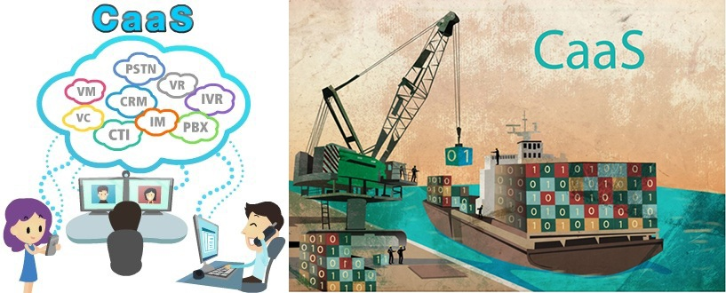
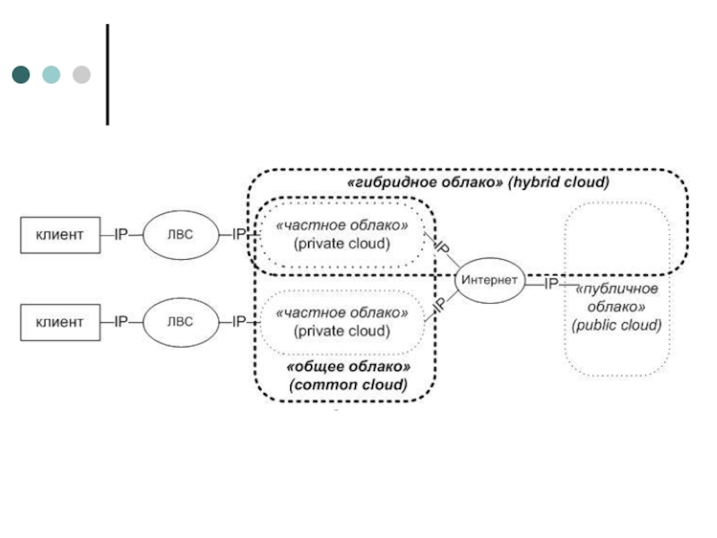

## CAAS или CAAS?
CAAS или CAAS?

CaaS, или Communications–as–a–service, представляет собой услугу «коммуникация как сервис», которая связана с построением в облаке провайдера коммуникационного решения для предприятия.

CaaS, или Containers–as–a–service, – новый вид услуги, именуемой «контейнеры как сервис». Веяние контейнерной реализации породило услугу, в которой контейнерные решения, инструменты и основные вычислительные ресурсы предоставляются пользователям как сервис.

---

## BaaS - надежный инструмент для сохранности данных
BaaS - надежный инструмент для сохранности данных

Чтобы не задумываться над установкой backup-решений, клиенту предлагается услуга «резервное копирование как сервис» (BaaS, Backup-as-a-service), которая позаботится о защите данных в облачном пространстве.

---

## MaaS - специфика облачного мониторинга
MaaS - специфика облачного мониторинга

MaaS, или Monitoring-as-a-service, выступает новым классом облачного решения, представляющего услугу «мониторинг как сервис».

Выступая обслуживаемым в облаке программным обеспечением для мониторинга, она позволяет снизить расходы на установку и поддержку системы мониторинга.

---

## DaaS: виртуальный рабочий стол под собственные задачи
DaaS: виртуальный рабочий стол под собственные задачи

DaaS, или Desktop-as-a-service, «Рабочий стол как услуга» – распространенное решение, которое позволяет использовать виртуальный рабочий стол как услугу.

---

## DBaaS: управляй базами данных
DBaaS: управляй базами данных

DBaas, или Database-as-a-service, представляет собой услугу «база данных как сервис», которая тарифицируется по объему используемой БД и количеству клиентских подключений.

---

## DRaaS: гарантированное восстановление инфраструктуры
DRaaS: гарантированное восстановление инфраструктуры

DRaaS, или Data-recovery-as-a-service, – услуга по восстановлению инфраструктуры после сбоев.

---

## Slide 33
NaaS: эксплуатация сервисов транспортных соединений

NaaS, или Network-as-a-service, представляет собой услугу «сеть как сервис». Принцип работы NaaS основан на эксплуатации сервисов транспортных соединений, или, проще говоря, на продаже сетевых услуг клиентам, не желающим строить собственную сетевую инфраструктуру.

---

## STaaS: дисковое пространство по требованию
STaaS: дисковое пространство по требованию

STaaS, или Storage-as-a-service, – это услуга «хранение как сервис», которая предполагает использование дискового пространства по требованию. Сервис STaaS дает возможность сохранять данные на внешнем носителе в облаке хостинг-провайдера, который на стороне пользователя выглядит как дополнительный логический диск или папка.

---

## Slide 35
Модели развертывания облака

---

## Slide 36
Модели развертывания облака

Private cloud (частное облако) - инфраструктура, предназначенная для использования облачных вычислений в масштабе одной организации.

Community cloud (облако сообщества) - облачная инфраструктура, которая предназначена для исключительного использования облачных вычислений определенным сообществом потребителей от организаций, которые решают общие проблемы .

---

## Модели развертывания облака – Частное облако (Private Cloud)
Модели развертывания облака – Частное облако (Private Cloud)

---

## Slide 38
Модели развертывания облака – Облако сообщества (Community Cloud)

Инфраструктура облака распределена между несколькими организациями и поддерживается сообществом

Управляется организациями или третьей стороной

Предприятие P

---

## Slide 39
Public cloud (публичное облако) - инфраструктура, предназначенная для свободного использования облачных вычислений широкой публикой.

Hybrid cloud (гибридное облако) - это комбинация различных облачных инфраструктур (частных, публичных или сообществ), остающихся уникальными объектами, но связанных между собой стандартизованными или частными технологиями, которые обеспечивают возможность обмена данными и приложениями.

Модели развертывания облака

---

## Модели развертывания облака – Публичное облако (Public Cloud)
Модели развертывания облака – Публичное облако (Public Cloud)

---

## Модели развертывания облака – Гибридное облако (Hybrid Cloud)
Модели развертывания облака – Гибридное облако (Hybrid Cloud)

---

## Гибридное облако
Гибридное облако

---

## Инфраструктура облака
Инфраструктура облака

---

## Физическая инфраструктура
Физическая инфраструктура

Физическая инфраструктура включает в себя физические IT ресурсы

Физические серверы (Physical servers)

Системы хранения данных (Storage systems)

Физические компоненты сети (Physical network components)

Физические серверы связаны друг с другом, с системами хранения данных и с клиентами посредством физических сетей

Физические ресурсы могут находиться в одном ЦОД или могут быть распределены между несколькими

---

## Виртуальная инфраструктура состоит из:
Виртуальная инфраструктура

Виртуальная инфраструктура состоит из:

Пулов ресурсов (Resource pools)

ЦПУ, память, пропускная способность сети (network bandwidth), хранение данных

Пулов идентификаторов

VLAN ID (Виртуальная локальная компьютерная сеть), VSAN ID, MAC адрес

Виртуальных IT ресурсов

Виртуальные машины (Virtual Machines (VMs)), виртуальные тома (virtual volumes), виртуальные сети (VLAN и VSAN)

Компоненты сети VM, такие как виртуальные коммутаторы (virtual switches) и виртуальные сетевые карты (virtual NICs)

Виртуальные IT ресурсы получают основные свойства от ресурсов и пулов

---

## Набор оборудования включает в себя:
Приложения и платформы (Applications and Platform Software)

Набор оборудования включает в себя:

Бизнес приложения

Платформы, как ОС и база данных

Для создания условий для запуска приложений

Инструменты миграции (Migration tools)

Приложения и платформы устанавливаются на виртуальных машинах

Для создания систем «Программное обеспечение как услуга» (software-as-a-service (SaaS)) и «Платформа как услуга» (platform-as-a-service (PaaS))

Инструменты перемещения используются для  развертывания приложений и платформ

Для систем «Платформа как услуга» (platform-as-a-service) и «Инфраструктура как услуга» (infrastructure-as-a service)

---

## Управление физической и виртуальной инфраструктурой
Управление инфраструктурой облака и инструменты создания услуг

Управление физической и виртуальной инфраструктурой

Управление запросами на услуги и снабжение облачными услугами

Предоставление администраторам интерфейса для управления ресурсами при помощи виртуализованных центров обработки данных (VDCs)

Управление инфраструктурой облака и инструменты создания услуги делятся на:

ПО для управления виртуальной инфраструктурой

ПО для унифицированного управления

ПО для управления доступом пользователей

Взаимодействие между ними для автоматического обеспечения облачными услугами

---

## Создает виртуальную инфраструктуру из имеющейся физической инфраструктуры
ПО для управления инфраструктурой облака

Создает виртуальную инфраструктуру из имеющейся физической инфраструктуры

Позволяет  формировать пулы и виртуальные ресурсы

Дискретный метод для формирования ресурсов вычисления, хранения данных и сети независимо

---

## Slide 49
ПО для унифицированного управления

Взаимодействует с оборудованием для управления виртуальной инфраструктурой

Сбор информации о конфигурации, взаимосвязанности и использовании существующих ресурсов физической и виртуальной инфраструктуры

Предоставляет консолидированный взгляд на существующие физическую и виртуальную инфраструктуру через виртуализованные центры обработки данных

Способствует мониторингу производительности, возможности и доступности ресурсов

Обеспечивает интерфейсом для создания виртуальных ресурсов и пулов, увеличивает мощность и идентичность существующих пулов

Отправляет команды конфигурации соответсвующему оборудованию управления виртуальной инфраструктурой

Исключает управление системой вычисления, хранения данных и сети обособленно

---

## Создает облачные услуги
ПО для унифицированного управления (продолжение)

Создает облачные услуги

Осуществляет процессы для конструирования облачных услуг, такие как:

Ранжирование ресурсов (Grading resources)

Объединение ресурсов (Bundling resources)

Определение услуг (Defining services)

Распределение ресурсов (Distributing resources)

---

## Ранжирование ресурсов    (Grading Resources):
ПО для унифицированного управления (продолжение)

Ранжирование ресурсов    (Grading Resources):

Процесс классификации пулов, основанный на производительности и мощности

Определяет различные ранги (Золото, Серебро, Бронза) для каждого типа пула (вычисление, хранение, сеть)

Проранжированные пулы используются для создания набора облачных услуг

Ранг ‘Золото’ : Устройства Flash, FC, и SATA, поддерживает автоматическое многоуровневое хранение данных , емкость 3 TB (Flash 1TB, FC 1TB, SATA 1TB), и уровень RAID  (Избыточный массив независимых дисков) 5

Ранг ‘Серебро’: Устройства Flash, FC, и SATA, поддерживает автоматическое многоуровневое хранение данных , емкость 3 TB (Flash 0.5TB, FC 1TB, SATA 1.5TB) и уровень RAID 1+0

Ранг ‘Бронза’: Устройства FC, емкость 2TB, уровень RAID 5, и не предоставляет автоматического многоуровневого хранения данных

Пример: ранжирование пулов хранения

---

## Объединение ресурсов
ПО для унифицированного управления (продолжение)

Объединение ресурсов

(Bundling Resources):

Процесс интеграции проранжированных вычислительных пулов (Вычислительный пул) (ЦПУ (CPU) + память) с проранжированным пулом сети (Пул сети) и пулом хранения (Пул хранения)

Каждая группа может быть объединена в соответствии с приложением и /или платформой для создания облачной услуги

За исключением IaaS

Каждая группа предоставляет ресурсы для создания облачной услуги

---

## Определение услуг (Defining Services):
ПО для унифицированного управления (продолжение)

Атрибуты услуги (SaaS):

Приложение: SAP

ОС: Windows Server 2003

ЦПУ: 5.86 GHz

Память: 10 GB

Хранение данных: 100 GB

Пропускная способность сети: 1 Gbps

Backup: 1 local and 1 remote

Местоположение: ABC

Примеры услуг

Атрибуты услуги (PaaS):

ОС: Windows Server 2008

ЦПУ: 2.93 GHz

Память: 4 GB

Хранение данных: 50 GB

Пропускная способность сети: 1 Gbps

Backup: 1 local and 1 remote

Местоположение: XYZ

Атрибуты услуги (IaaS):

ЦПУ: 5.86 GHz

Память: 10 GB

Хранение данных: 80 GB

Пропускная способность сети : 1 Gbps

Backup: 1 local and 1 remote

Местоположение: ABC

Определение услуг (Defining Services):

Процесс документирования атрибутов всех облачных услуг, которые создаются из разных групп

Аттрибуты услуги:

ЦПУ, память, пропускная способность сети (network bandwidth) и доступное пространство

Названия и описания приложений и платформ

Местонахождение виртуализованного центра обработки данных (VDC), из которого ресурсы будут перемещены

Политика бэкапа

Атрибуты услуги ставятся в соответсвие с виртуальными машинами (VMs)

---

## Распределение ресурсов
ПО для унифицированного управления (продолжение)

Распределение ресурсов

(Distributing Resources):

Процесс создания точек предоставления услуг (service instances) и распределения ресурсов из групп по вариантам услуг в момент запрашивания сервиса потребителем

Для создания вариантов услуг виртуальные машины (VMs) конструируются и интегрируются с виртуальной локальной компьютерной сетью (VLAN) и  виртуальной мощностью (виртуальный диск (virtual disk))

Варианты услуг получают ресурсы на основе предопределенных атрибутов услуг

---

## Предоставляет Web based пользовательский интерфейс для потребителей
ПО для управления доступом пользователей

Предоставляет Web based пользовательский интерфейс для потребителей

Позволяет потребителям запрашивать облачные услуги

Взаимодействует с оборудованием для комплексного управления и перенаправляет все запросы на услуги

Позволяет администраторам создавать и публиковать каталог услуг

Каталог услуг: структурированный документ с информацией обо всех облачных услугах, доступных для потребителей

Аутентифицирует потребителей до выполнения их запросов услуг

Контролирует местонахождение или использование ресурсов, связанных с каждым вариантом облачной услуги

Генерирует отчет о начислении затрат, видимый для потребителей

---

## Основные понятия, раскрытые в данной лекции:
Итоги

Основные понятия, раскрытые в данной лекции:

Характеристики облачных вычислений

Модели  облачных услуг

Модели развертывания облака

Инфраструктура облака
