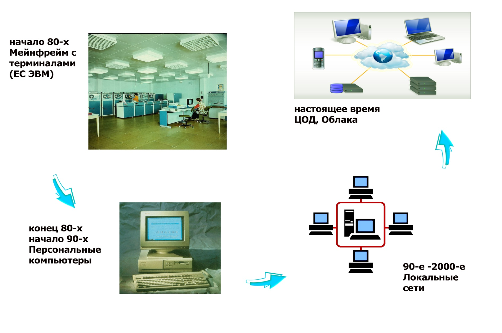
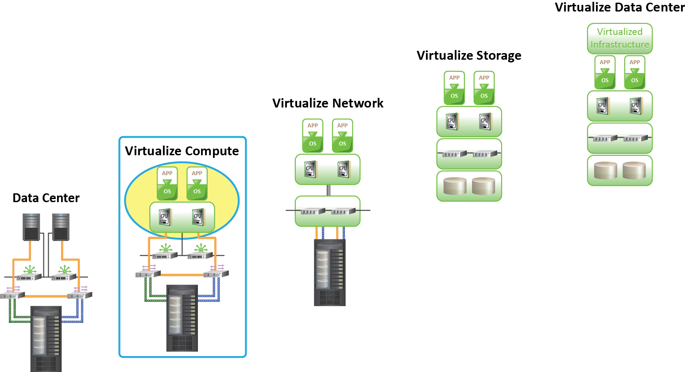

# Проблемы перехода к облаку
Проблемы перехода к облаку

---

# Преимущества облаков (эффективность)
Преимущества облаков (эффективность)

---

# Преимущества облаков (Адаптивность)
Преимущества облаков (Адаптивность)

---

# Преимущества облаков (инновации)
Преимущества облаков (инновации)

---

# Цикл ИТ в России
Цикл ИТ в России

---

# Мотивация к распространению облачных технологий в российском госсекторе
Мотивация к распространению облачных технологий в российском госсекторе

---

# Slide 8
Что мешает? Консерватизм

---

# Slide 9
Что мешает? Ведомственность

---

# Slide 10
Что мешает? Законодательство

---

# Slide 11
Что мешает? Безопасность

---

# Slide 12
Миграция в облако

---

# Задачи миграции в облако
Задачи миграции в облако

Решения для моделей облачных услуг и подходящие для облака приложения

Критерии выбора поставщика облачных услуг

Соглашение об уровне оказания услуг (Service Level Agreements (SLAs)) и проблемы, связанные с производительностью

Vendor lock-in

Открытые стандарты облачных услуг

---

# IT руководители/менеджеры, которые планируют перейти к облачным услугам, сталкиваются со следующими вопросами:
Миграция в облако – ключевые вопросы

IT руководители/менеджеры, которые планируют перейти к облачным услугам, сталкиваются со следующими вопросами:

Как облако отвечает требованиям организаций?

Финансовые преимущества, удобство и т.д.

Какие приложения подходят для облака?

Как выбрать поставщика облачных услуг?

Способна ли инфраструктура облака предоставить требуемое качество услуг (QoS)?

Мощность, доступность и безопасность

Как решать проблемы, связанные с управлением изменениями?

Что может дать облако?

Приложение, платформа и инфраструктура

---

# Текущая инфраструктура и требования
Как облако отвечает Вашим требованиям?

Текущая инфраструктура и требования

Принимая во внимание аспекты приложения, сети и безопасности

‘Риск - выгода’

На основе данного профиля, выбрать модель облака для организации

---

# Стартап
Какая модель Вам подходит?

Индивидуальный

пользователь

Стартап

Малый и средний

бизнес

Предприятие

---

# Выбор приложения для публичного облака
Выбор приложения для публичного облака

Частное и критически важное приложение

Собственные приложения обеспечивают наличие конкурентного преимущества

Организация несет высокие риски для перемещения этого приложения в облако

Эти приложения обычно поддерживаются внутри организации

Не частное, но критически важное приложение

Организация несет высокие риски для перемещения приложения в облако

Оно может быть перемещено на облако, если:

Организация не располагает достаточным количеством ресурсов для поддержания приложения

Не частное и не критически важное приложение

Рассматривается как хороший вариант для облака, если оно не требовательно по отношению к производительности

---

# Ключевые вопросы для выбора провайдера:
Выбор провайдера облачных услуг

Ключевые вопросы для выбора провайдера:

Как долго организация предоставляет услуги?

Насколько успешно  организация отвечает текущим и будущим требованиям?

Насколько просто отказаться от неиспользуемых ресурсов и снизить издержки?

Какие инструменты (например, образы виртуальных машин), при помощи которых несложно перейти к другому провайдеру, предлагает организация?

Насколько просто добавить/поменять набор услуг?

Предоставляет ли провайдер высокий уровень технической поддержки клиентов?

Что произойдет в том случае, если провайдер обновит программное обеспечение? Принуждает ли это всех пользователей? Возможно ли обновление по собственному графику?

Предоставляет ли провайдер требуемый уровень безопасности услуг?

Отвечает ли организация частным требованиям и требованиям, связанными с законом?

---

# Соглашение между провайдером и потребителем облачных услуг, которое определяет качество и надежность сервиса
Соглашение об уровне оказания услуг(Service Level Agreement (SLA))

Соглашение между провайдером и потребителем облачных услуг, которое определяет качество и надежность сервиса

SLA также определяет санкции за несоблюдение пунктов соглашения

Включает в себя такие факторы, как доступность сети, мощность и т.д.

---

# Производительность облака
Производительность облака

Два ключевых параметра производительности:

Производительность инфраструктуры

Насыщение инфраструктуры облака может повлиять на мощность

Подходящее количество ресурсов может быть распределено на приложение для обеспечивания мощности

Задержка в сети

Задержка в сети обычно возникает по причине передачи большого количества данных провайдеру облачных услуг

---

# Cloud Vendor Lock-in (Привязка к поставщику)
Cloud Vendor Lock-in (Привязка к поставщику)

Поставщик облачных технологий (провайдер услуг) может  не иметь открытых стандартов облачных услуг или использовать частное программное обеспечение/API

Жесткая договоренность вводит штрафные санкции на внесение пользователем изменений

Поставщик облачных технологий может предотвратить переход потребителя от одной модели услуг к другой (например, приложение, построенное на модели PaaS, изменяющееся в сторону модели IaaS)

Приложение может требовать значительных изменений перед развертыванием в разных типах облака

---

# Использовать надежные и повсеместно использующиеся технологии
Открытые стандарты облачных услуг

Использовать надежные и повсеместно использующиеся технологии

Предотвратить случаи  vendor lock-in

Пример: Open Virtual Machine Format (OVF)

---

# Этапы выбора облака
Этапы выбора облака

Использование данного подхода к выбору облака обеспечивает плавный переход

Cloud

---

# Данный этап включает в себя рассмотрение различных факторов
Данный этап включает в себя рассмотрение различных факторов

Помимо задач, указанных ранее, дополнительными параметрами оценки являются:

Финансовая оценка

Оценка безопасности и соответствия требованиям

Техническая оценка

Изучение случаев с лицензированными продуктами

Этап 1: Оценка

---

# Сравнивает затраты привлечения провайдера услуг с затратами внутреннего пользования
Финансовая оценка

Сравнивает затраты привлечения провайдера услуг с затратами внутреннего пользования

Total Cost of Ownership (TCO) и Return on Investment (ROI)

Предполагает сравнение затрат по следующим элементам:

---

# На ранних этапах оценки задействует консультанта по безопасности
Оценка безопасности и соответствия требованиям

На ранних этапах оценки задействует консультанта по безопасности

Позволяет организации:

Определить допустимые риски и угрозы безопасности приложений

Понять нормативные/договорные обязательства по хранению данных в специфических юрисдикциях

Изучить предлагает ли поставщик облачных услуг:

Выбор географического местонахождения хранения данных

Гарантию того, что данные не изменят местонахождения, пока организация не решит изменить его

Изучить возможности получения данных из облака по требованию

Определить политику скачивания или удаления данных, если требуется

Определить вид шифрования данных при передаче и хранении

---

# Позволяет организации:
Техническая оценка

Позволяет организации:

Определить, предоставляет ли провайдер облачных услуг требуемую инфраструктуру

Определить, соответствует ли приложение инфраструктуре облака

Определить зависимость приложения от других компонентов и услуг

Определить компоненты, которые могут быть размещены локально (on-premise) и компоненты, которые могут быть перемещены в облако

Определить требования по задержке сети и пропускной способности

Оценить трудозатраты по перемещению приложения

---

# Использование существующей лицензии
Оценка задач по лицензированию

Использование существующей лицензии

Определить, может ли организация переместить существующее лицензированное программное обеспечение в облако

Провайдеры облачных услуг состоят в партнерстве с поставщиками ПО для разрешения использования существующего лицензированного ПО в облаке

Использование облачных услуг на основе модели SaaS

Некоторые поставщики ПО предлагают ПО как услугу, а не как устанавливаемую опцию

Если поставщик ПО не предлагает ПО как услугу, то необходимо изучить другие варианты предложений поставщиков облачных услуг

---

# Этап 2: Доказательство концепции
Этап 2: Доказательство концепции

Цель данного этапа состоит в том, чтобы проверить как работает приложение в облаке

Proof-of-concept позволяет организации:

Изучить возможности облака

Изучить различные опции обеспечения бесперебойности деятельности и аварийного восстановления, предлагаемые провайдером облачных услуг

Оценить насколько сложно развертывать приложение

Определить приложения, которые могут быть немедленно перемещены после проверки

---

# Этап 3: Миграция
Этап 3: Миграция

---

# Этап 4: Оптимизация
Этап 4: Оптимизация

Тестирование приложения после завершения миграции

Позволяет понять правила использования и оптимизировать потребление ресурсов

Позволяет отказаться от неиспользуемых ресурсов

---

# Основные понятия, раскрытые в данной лекции:
Итоги

Основные понятия, раскрытые в данной лекции:

Проблемы перехода к облаку

Миграция  в облако

---

