## Этапы перехода От классического ЦОД к виртуализованному ЦОД
Этапы перехода От классического ЦОД к виртуализованному ЦОД

Классический ЦОД (CDC - Classic Data Center)

Виртуализация вычислений (Virtualize Compute)

Виртуализация хранения данных  (Virtualize Storage)

Виртуализация сети  (Virtualize Network)

Виртуализованный ЦОД (VDC - Virtualized Data Center)

---

## Использование пошагового подхода к виртуализации ЦОД позволяет сделать переход к виртуализованным элементам более гладким
Этапы преобразования CDC в VDC

Классический ЦОД (CDC)

Виртуализованный ЦОД

(Virtualized Data Center (VDC))

Использование пошагового подхода к виртуализации ЦОД позволяет сделать переход к виртуализованным элементам более гладким

---

## Это техника маскировки или абстракции физической аппаратной части и реализация параллельной одновременной работы нескольких операционных систем (OSs) на одной физической или нескольких кластеризованных машинах
Виртуализация вычислений (Compute   virtualization)

Реализует создание нескольких виртуальных машин (VMs), каждая с собственной OS и приложениями

VM – логическая сущность, которая выглядит и ведет себя как физическая машина

Уровень виртуализации располагается между аппаратной частью и VM

Также известен как гипервизор

Для VM выделяются стандартизированные аппаратные ресурсы

Это техника маскировки или абстракции физической аппаратной части и реализация параллельной одновременной работы нескольких операционных систем (OSs) на одной физической или нескольких кластеризованных машинах

---

## Консолидация серверов
Преимущества виртуализации на уровне вычислений

Консолидация серверов

Изоляция

Инкапсуляция

Независимость от аппаратной части

Сокращенная стоимость

Необходимость виртуализации вычислений

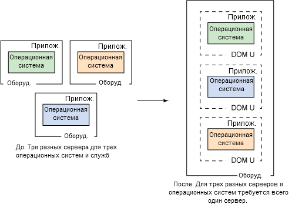

---

## ПО, которое позволяет нескольким операционным системам OS одновременно работать на одной физической машине и взаимодействовать напрямую с физической аппаратной частью
Гипервизор

Состоит из двух компонентов

Ядро (Kernel)

Монитор виртуальной машины (Virtual Machine Monitor (VMM))

ПО, которое позволяет нескольким операционным системам OS одновременно работать на одной физической машине и взаимодействовать напрямую с физической аппаратной частью

---

## Функции гипервизора
Функции гипервизора

изоляция операционных систем друг от друга;

разделение ресурсов между операционными системами;

управление ресурсами;

обеспечение защиты и безопасности операционных систем;

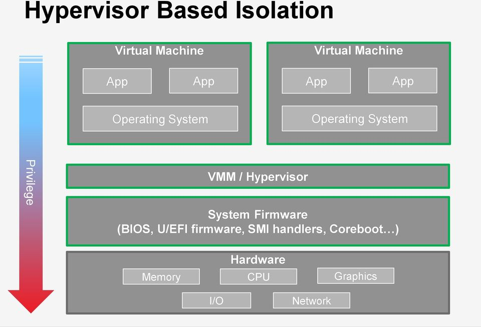

---

Типы гипервизоров

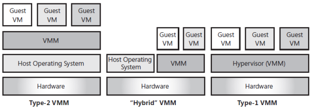

---

Гипервизоры Type-1

К гипервизорам первого типа относят:

Nutanix AHV,

XCP-ng,

Oracle VM Server,

VMware ESXi.

---

Гипервизоры Type-2

К гипервизорам второго типа относят:

Microsoft Virtual PC;

VMware Workstation;

QEMU;

Parallels;

VirtualBox.

---

## Гипервизоры Hybrid VMM
Гипервизоры Hybrid VMM

К гибридным гипервизорам относят:

Sun Logical Domains;

Citrix XenServer;

Microsoft Hyper-V;

VMware Workstation.

---

## Основные параметры гипервизоров
Основные параметры гипервизоров

---

## Операционная система (OS) разработана для функционирования на bare-metal аппаратной части и полного контроля за аппаратной частью
Требования: виртуализация x86 аппаратной части

Операционная система (OS) разработана для функционирования на bare-metal аппаратной части и полного контроля за аппаратной частью

x86 архитектура предлагает четыре уровня привилегий

Ring 0, 1, 2, и 3

Пользовательские приложения запускаются на уровне Ring 3

OS запускается на уровне Ring 0 (наиболее привилегированный)

Вызовы виртуализации x86 аппаратной части

Требует помещения уровня виртуализации под уровень OS

Сложности выявления и трансляции привилегированных инструкций OS на ходу

Техники виртуализации вычислений

Полная (Full), пара (Para), и виртуализация при помощи аппаратной части (hardware assisted)

---

## Монитор виртуальной машины (VMM) запускается на привилегированном уровне Ring 0
Монитор виртуальной машины (VMM) запускается на привилегированном уровне Ring 0

VMM отделяет гостевую операционную систему (guest OS) от физической аппаратной части

За каждой VM закрепляется VMM

Предоставляет физические компоненты каждой VM

Выполняет бинарную трансляцию (Binary Translation (BT)) невиртуализуемых инструкций OS

Гостевая OS (Guest OS) не знает о том, что она виртуализована

Полная (Full) виртуализация

---

## Гостевая операционная система знает о том, что она виртуализована
Гостевая операционная система знает о том, что она виртуализована

Гостевая OS запущена на уровне Ring 0

Используется модифицированное ядро гостевой OS, таких как Linux и OpenBSD

Немодифицируемые гостевые OS, такие как Microsoft Windows, не поддерживаются

Para-виртуализация

---

## Достигается за счет использования осведомленного о наличии гипервизора CPU, обрабатывающего привилегированные инструкции
Достигается за счет использования осведомленного о наличии гипервизора CPU, обрабатывающего привилегированные инструкции

Сокращает издержки, связанные с виртуализацией в режимах полной и  para-виртуализации

Виртуализация CPU и памяти достигаются за счет аппаратной части

Реализуется технологиями AMD-V и Intel VT для x86 процессорной архитектуры

Hardware Assisted виртуализация

---

## С точки зрения пользователя – логическая вычислительная система
С точки зрения пользователя – логическая вычислительная система

Запускает операционную систему и приложения точно так же, как и физическая машина

Содержит виртуальные компоненты, такие как CPU, RAM, диск, и сетевую карту

С точки зрения гипервизора

Виртуальная машина – дискретный набор файлов, таких как файлы конфигурации, файлы виртуального диска, виртуальный BIOS файл, файл подкачки (swap) виртуальной машины, и лог-файл

Виртуальная машина

---

## Файловые системы, поддерживаемые гипервизором: Virtual Machine File System (VMFS) и Network File System (NFS)
Файловые системы, поддерживаемые гипервизором: Virtual Machine File System (VMFS) и Network File System (NFS)

VMFS

Кластерная файловая система, позволяющая нескольким физическим машинам выполнять операции чтения/записи одновременно на одном устройстве хранения

Разворачивается на FC и iSCSI устройствах хранения отдельно от локального хранения

Реализует хранение файлов виртуальной машины на удаленном файловом сервере (NAS устройство)

NFS клиент встроен в гипервизор

Файловая система для управления файлами  VM

---

## Архитектура виртуальной машины Java (JVM)
Архитектура виртуальной машины Java (JVM)

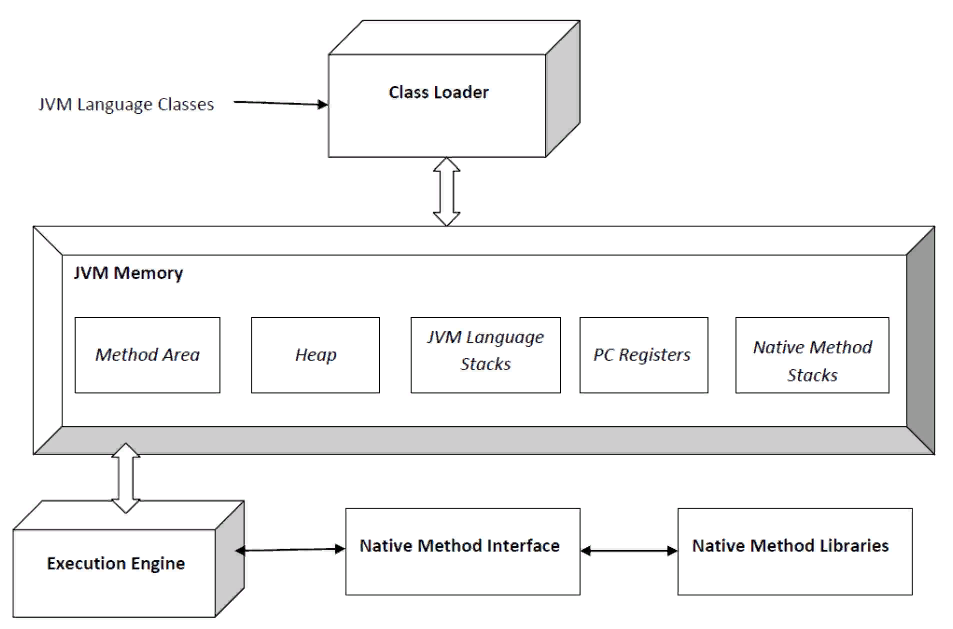

---

## Архитектура виртуальной машины LC-3
Архитектура виртуальной машины LC-3

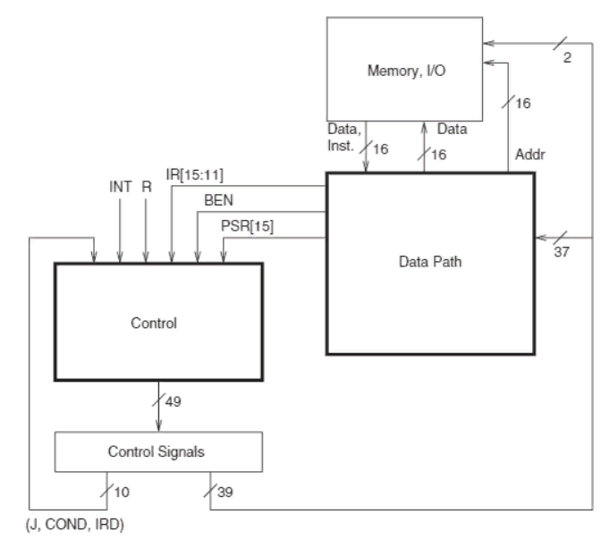

---

## Виртуальный процессор
Виртуальный процессор

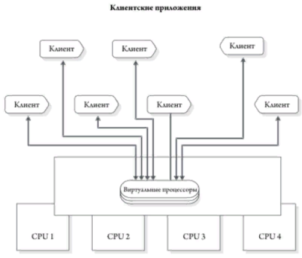

---

## Классы виртуальных процессоров
Классы виртуальных процессоров

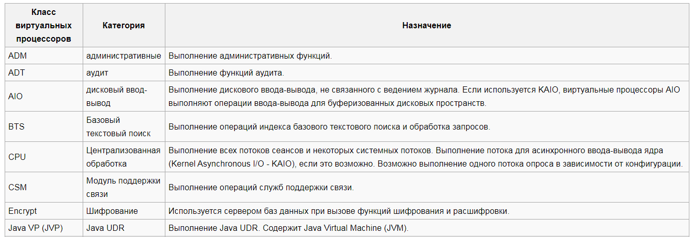
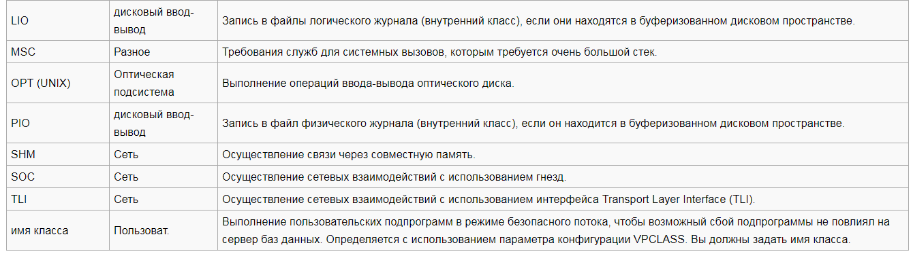

---

## Виртуальная память
Виртуальная память

Абстрактное представление виртуальной памяти

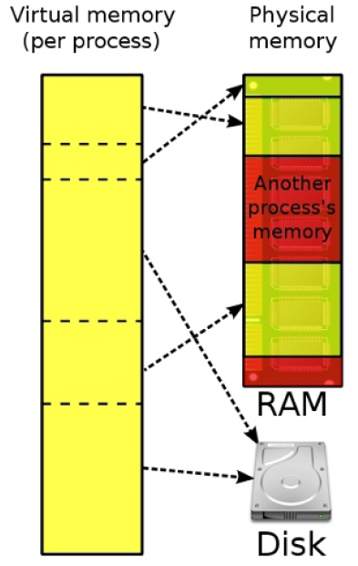

---

## Трансляция логического адреса в физический
Трансляция логического адреса в физический

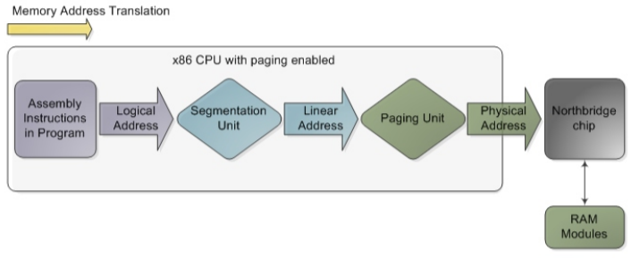

---

## Страничная организация памяти
Трансляция адреса в страничной модели

Страничная организация памяти

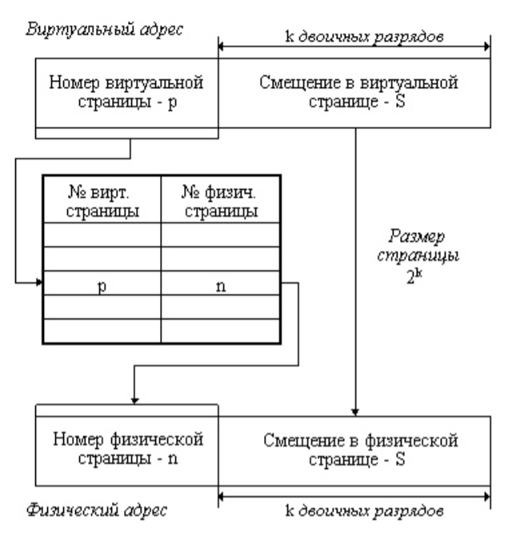

---

## Память процесса в страничной модели
Память процесса в страничной модели

Запись в таблице страниц

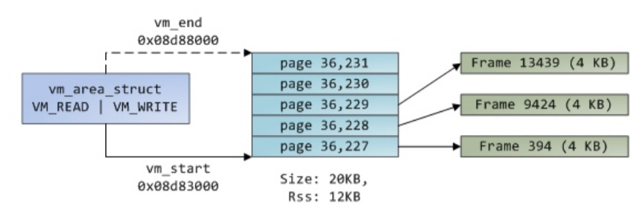
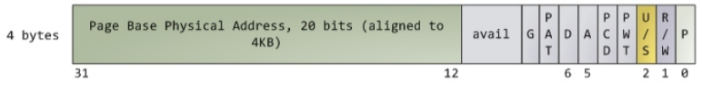

---

## Многоуровневая таблица страниц
Многоуровневая таблица страниц

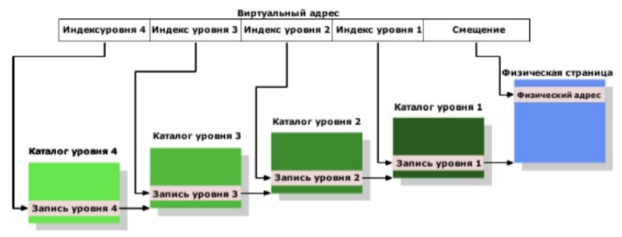

---

## Сегментная организация памяти
Сегментная организация памяти

Представление сегментной модели виртуальной памяти

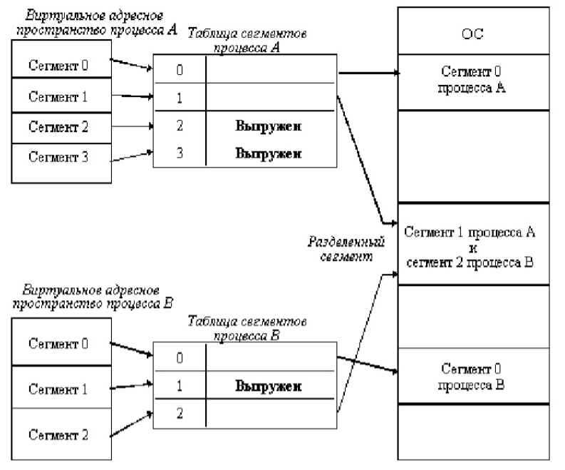

---

## Типы виртуальных дисков
Типы виртуальных дисков

Базовая структура виртуального динамического жесткого диска

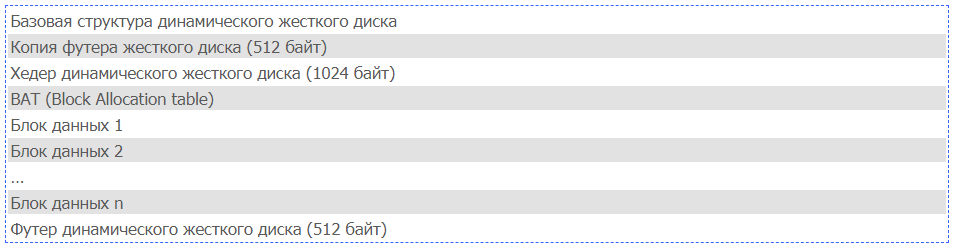

---

## Значения типов диска
Значения типов диска

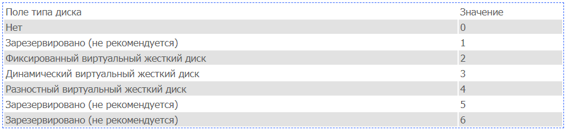

---

## Сетевой интерфейс виртуальной машины (vNIC)
Сетевой интерфейс виртуальной машины (vNIC)

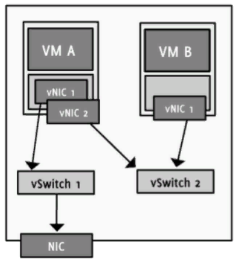

---

## Программы - эмуляторы виртуальных CD/DVD - ROM устройств
Программы - эмуляторы виртуальных CD/DVD - ROM устройств

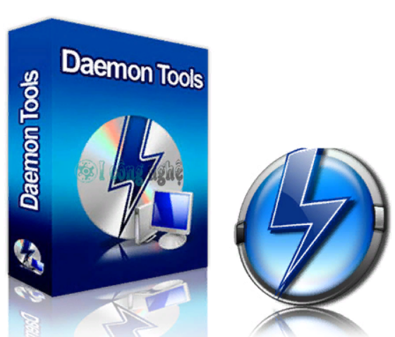

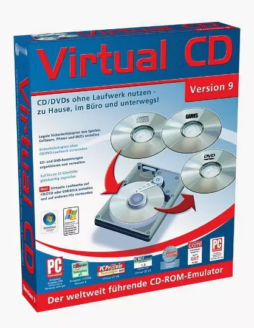
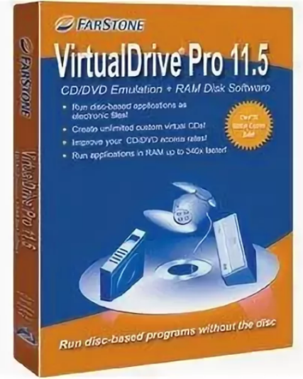

---

## Виртуальный SCSI контроллер
Виртуальный SCSI контроллер

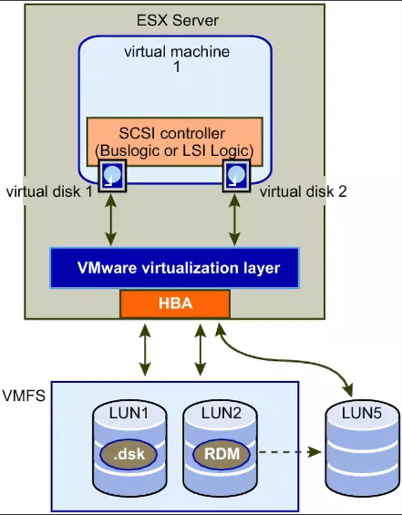

---

## Виртуальный USB контроллер
Виртуальный USB контроллер

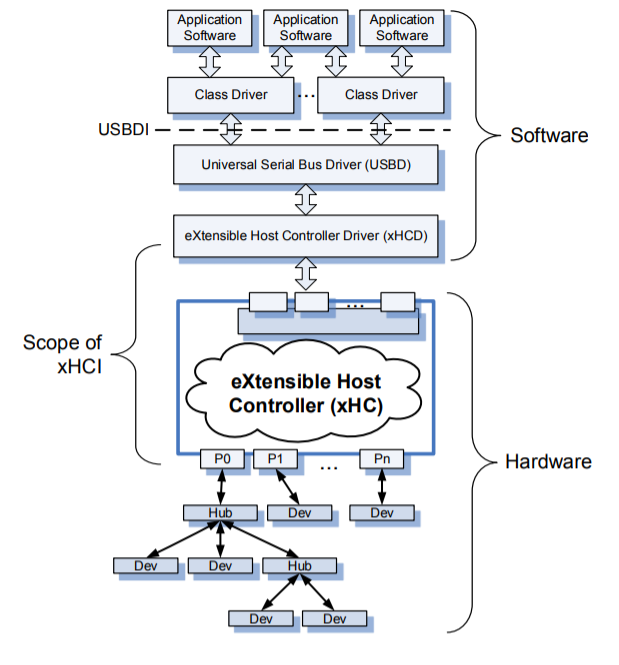

---

## Управление ресурсами
Управление ресурсами

Цели управления ресурсами

Контроль использования ресурсов

Предотвращение монополии на ресурсы со стороны виртуальных машин

Выделение ресурсов в соответствии с относительными приоритетами виртуальных машин

Для централизованного управления ресурсы должны быть объединены в пулы

Процесс выделения ресурсов от физической или кластеризованных физических машин виртуальным машинам для оптимизации использования ресурсов

---

## Пул ресурсов – это логическая абстракция агрегированных и централизованно управляемых физических ресурсов
Пул ресурсов – это логическая абстракция агрегированных и централизованно управляемых физических ресурсов

Создается из физической машины или кластера

Администраторы могут создавать дочерние пулы или виртуальные машины из родительских пулов ресурсов

Резервирование (reservation), лимит (limit), и доля (share) используются для контроля ресурсов, потребляемых пулами ресурсов виртуальных машин

---

## Оптимизация ресурсов CPU
Оптимизация ресурсов CPU

Современные CPU оснащены несколькими ядрами, а также технологией многопоточности (hyper-threading)

Многоядерные процессоры обладают несколькими вычислительными модулями (ядрами) на одном CPU

Многопоточность позволяет физическому CPU быть представленным как два или более логических CPU

Правильное и эффективное выделение ресурсов CPU является критическим

Гипервизор распределяет виртуальные CPU по физическим CPU

Гипервизор поддерживает многоядерность, многопоточность, и функции балансировки нагрузки на CPU для оптимизации использования ресурсов

---

## Гипервизор управляет физической памятью машины
Оптимизация использования ресурсов памяти

Гипервизор управляет физической памятью машины

Часть данной памяти используется гипервизором

Остаток доступен для виртуальных машин

VM может быть сконфигурирована с большим количеством памяти, нежели доступно, что называется ‘memory overcommitment’

Оптимизация памяти выполняется для реализации overcommitment процесса

Техники управления памятью: прозрачное разделение страниц (transparent page sharing), раздувание памяти (memory ballooning), и использование файла подкачки памяти (memory swapping)

---

## Каждая включенная виртуальная машина нуждается в собственном файле подкачки (swap file)
Использование файла подкачки памяти (memory swapping)

Каждая включенная виртуальная машина нуждается в собственном файле подкачки (swap file)

Создается в момент включения VM

Удаляется, когда VM выключается

Размер файла подкачки равен разнице между лимитом памяти и зарезервированной для VM памятью

Гипервизор сгружает данные из памяти VM в файл подкачки в случае нехватки памяти

Использование файла подкачки является крайней мерой поскольку оно оказывает существенное влияние на производительность

---

## VM to VM совместимость:
Совместимость виртуальных машин (Virtual Machine Affinity)

VM to VM совместимость:

Выбранные машины должны быть запущены на одном гипервизоре

Для улучшения производительности, в случае, если машины часто взаимодействуют между собой

Несовместимость (anti-affinity) означает, что выбранные виртуальные машины не могут располагаться на одном гипервизоре (например, с точки зрения доступности)

Совместимость VM и физического сервера:

Указывает, может ли указанная VM быть запущена на определенном гипервизоре (например, с точки зрения вопросов лицензирования)

Несовместимость – разрешение VM мигрировать между различными виртуальными машинами в кластере (например, по требованиям доступности и производительности)

---

## Средства для управления ресурсами
Средства для управления ресурсами

Обеспечивают возможность управления физическими машинами, на которых запущен гипервизор

Реализуют централизованное управление ресурсами со стороны сервера управления

Реализуют пулинг ресурсов и выделение мощностей виртуальным машинам

Взаимодействуют с гипервизором для выполнения операций управления

Обеспечивают автоматизацию операций

---

## Основные понятия, раскрытые в данной лекции:
Итоги

Основные понятия, раскрытые в данной лекции:

Этапы перехода от ЦОД к виртуализованному ЦОД

Виртуализация вычислений

Гипервизор, типы гипервизоров

Виртуальная машина

Компоненты аппаратной части виртуальной машины

---

