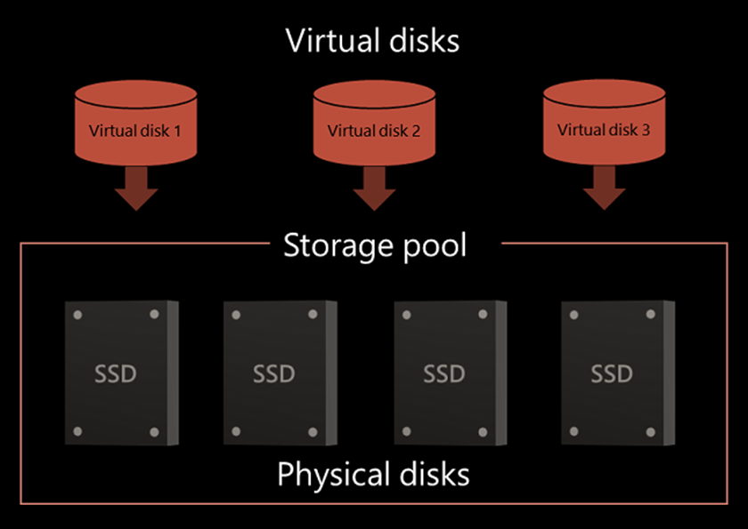

## Классический ЦОД (CDC)
Этапы преобразования CDC в VDC

Классический ЦОД (CDC)

Виртуализация вычислений

(Virtualize Compute)

Виртуализация хранения данных

(Virtualize Storage)

Виртуализация сети

(Virtualize Network)

Виртуализованный ЦОД

(Virtualized Data Center (VDC))

---

## Виртуализация ХД
Виртуализация ХД

Виртуализацию хранения данных сегодня называют самой выгодной инвестицией в бизнес. Эта технология позволяет распоряжаться данными как ресурсом, рационально распределяя их по производительности, доступности, отказоустойчивости и безопасности.

Благодаря виртуализации легко решается проблема управления большими объемами информации и миграции данных с одного носителя на другой. Достаточно связать несколько дисковых массивов в одном программно-аппаратном комплексе, и на выходе появится система, работающая как единый организм.

---

## Что такое виртуализация хранения данных?
Что такое виртуализация хранения данных?

Виртуализация хранения данных — это представление ресурсов хранения в абстрактном виде, как логические пространства хранения (тома) и без привязки к физическим накопителям. Технология обеспечивает удобный и прозрачный способ управления хранением, когда реальные устройства хранения, подключенные по различным протоколам, воспринимаются как единый пул.

---

## Задачи, которые решает виртуализация СХД
Задачи, которые решает виртуализация СХД

Экономия на расширении инфраструктуры

Оптимизация доступного места на накопителях

Упрощенный перенос данных и зеркалирование

Многоуровневое хранение данных

---

## Кому нужна виртуализация хранения данных?
Кому нужна виртуализация хранения данных?

Виртуализация подходят для ИТ-инфраструктуры, в которой есть несколько разрозненных СХД и в будущем планируется увеличение полезного дискового пространства. Это свойственно компаниям, которые наращивают клиентскую базу и постоянно нуждаются в дополнительном пространстве для баз данных или приложений. Использовать отдельные накопители им не выгодно — это усложняет систему хранения, делает ее менее гибкой, она хуже соответствует реальным потребностям бизнеса. Здесь виртуализация помогает объединить доступные ресурсы хранения независимо от их моделей, поддерживаемых интерфейсов, производителей и годов выпуска.

---

## Преимущества виртуализации хранения
Преимущества виртуализации хранения

Добавление и отключение устройств хранения происходит без простоя системы

Увеличение процента используемости системы, сокращение суммарной стоимости владения (TCO)

Непрерывная миграция данных между устройствами хранения

Поддержка разнородных платформ от различных поставщиков

Упрощение управления хранением данных

Сокращение затрат на администирование

---

## Недостатки виртуализации ХД
Недостатки виртуализации ХД

Из минусов виртуализации необходимо отметить более высокие требования к аппаратной основе, по сравнению с традиционными системами. Виртуализованные среды предъявляют высокие требования к мощности процессоров и объемам оперативной памяти. Все это приводит к тому, что виртуализованные решения могут оказаться дороже традиционных.

---

## Как это работает?
Как это работает?

Системы виртуализации хранения данных подразумевают разделение пула ресурсов на отдельные логические диски, которые можно добавлять по мере потребностей. ИТ-администраторы через центральную консоль размещают ресурсы хранения из общего пула на сервер приложений, и последний воспринимает виртуальные тома как реальные физические устройства, подключенные напрямую. Это упрощает администрирование ИТ-инфраструктуры и сетей хранения данных в частности. В рамках одной инфраструктуры технология может использоваться для разных задач: виртуализации серверов, приложений, рабочих столов, сетевых и других ресурсов.

---

## Виртуализация хранения на различных уровнях
Виртуализация хранения на различных уровнях

---

## Хранение данных виртуальных машин
Хранение данных виртуальных машин

Виртуальные машины хранятся в виде набора файлов на пространстве хранения, доступном для гипервизора

«Файл виртуального диска» (‘Virtual disk file’) представляет виртуальный диск, используемый VM для хранения ее данных

Размер виртуального диска представляет пространство на системе хранения, предоставленное виртуальному диску

Виртуальные машины не знают о Суммарном пространстве, доступном гипервизору

---

## Файловая система для управления файлами VM
Файловая система для управления файлами VM

Гипервизор использует две файловые системы для управления файлами виртуальных машин

«Родная» файловая система гипервизора (hypervisor’s native file system), называемая Virtual Machine File System (VMFS)

Network File System (NFS) для NAS систем

---

## Virtual Machine File System (VMFS)
«Родная» файловая система гипервизора для управления файлами виртуальных машин

Кластерная файловая система

Может быть доступна одновременно нескольким вычислительным системам

Обеспечивает механизм блокировки диска (on-disk locking)

Использует VMFS том для сохранения файлов виртуальных машин

Virtual Machine File System (VMFS)

Виртуальный

диск

Виртуальный

диск

Виртуальный

диск

---

## Гипервизор использует протокол NFS для доступа к файловой системе устройства NAS
Гипервизор использует протокол NFS для доступа к файловой системе устройства NAS

NFS тома создаются на NAS устройстве

Предоставляют пространство для хранения данных виртуальной машине

Одновременный доступ для нескольких вычислительных систем

Network File System

NFS Том

Вычислительная

система 1

Вычислительная

система 2

NAS Система

Виртуальный

диск

Виртуальный

диск

Виртуальный

диск

---

## Виртуализация, основанная на сетевых технологиях, позволяет реализовать интеллектуальную виртуализацию хранения на сетевом уровне
Виртуализация на блочном и файловом уровнях

Виртуализация, основанная на сетевых технологиях, позволяет реализовать интеллектуальную виртуализацию хранения на сетевом уровне

Предоставляет возможности

Объединять в пулы разнородные ресурсы хранения

Выполнять непрерывную миграцию данных

Управлять пулом ресурсов хранения данных с помощью единого интерфейса управления

Виртуализация хранения, основанная на сетевых технологиях, применяется на

Блочном уровне (SAN)

Файловом уровне (NAS)

---

## Виртуализация хранения на блочном уровне
Создает уровень абстракции на SAN между физическим устройством хранения и томами, предоставленными вычислительной системе

Использует устройство виртуализации (virtualization appliance) для выполнения операции отображения

Делает прозрачной для вычислительной системы физическую инфраструктуру хранения

Реализует существенную оптимизацию используемых ресурсов и затрат

Виртуализация хранения на блочном уровне

---

## Массив хранения
Отображение физического тома на виртуальный

Массив хранения

---

## Обеспечивает абстракцию в NAS/File server окружении
Обеспечивает абстракцию в NAS/File server окружении

Исключает зависимости между файлами и их расположением

Реализует перемещение файлов между NAS системами без влияния на клиентский доступ

Обеспечивает возможности по оптимизации используемости системы хранения

Реализуется с использованием глобального пространства имен (global namespace)

Виртуализация хранения на файловом уровне

---

## Реализует доступ клиентов к файлам с использованием логических имен, которые не зависят от актуального физического расположения
Виртуализация хранения на файловом уровне – Глобальное пространство имен (Global Namespace)

Реализует доступ клиентов к файлам с использованием логических имен, которые не зависят от актуального физического расположения

Отображает логический путь к файлу на имя физического пути

Упрощает доступ к файлам

Клиентам больше не нужно обладать различными точками подключения для доступа к данным, расположенным на различных NAS устройствах

---

## Виртуальное предоставление пространства («тонкое» предоставление пространства)
Виртуальное предоставление пространства («тонкое» предоставление пространства)

Емкость-по-запросу от разделяемого пула хранения, называемого «тонкий пул» (Thin pool)

Физическое пространство для хранения выделяется только когда вычислительная система запрашивает его

Решения о наличии пространства не привязаны к физически доступному пространству для хранения

Может быть реализовано на

Уровне хранения

Уровне вычислительной машины  – виртуальное выделение пространства для виртуального диска

Вычислительные системы

---

## Традиционное предоставление vs. Виртуальное предоставление
Традиционное предоставление vs. Виртуальное предоставление

Традиционное предоставление

400 GB

Выделенного

Неиспользуемого

пространства

100 GB Данных

500 GB

Выделенного

Неиспользуемого

пространства

50 GB Данных

200 GB Данных

600 GB

Выделенного

Неиспользуемого

пространства

LUN 1

LUN 2

LUN 3

Система хранения данных

2 TB

Виртуальное предоставление

100 GB  Выделено

50 GB Выделено

200 GB Выделено

Тонкий (Thin) LUN 1

Тонкий (Thin)

LUN 2

Тонкий (Thin)

LUN 3

500 GB

550 GB

800 GB

Система хранения данных

2 TB

500 GB

550 GB

800 GB

---

## «Тонкий логический модуль» (далее - Thin LUN)
«Тонкий логический модуль» (далее - Thin LUN)

Логическое устройство, для которого физическое пространство для хранения данных не должно полностью выделяться в момент создания

Воспринимается операционной системой как традиционный логический модуль (LUN)

Физическое пространство для хранения выделяется Thin LUN из «тонкого пула» (Thin pool)

Минимальный размер физического пространства для хранения, выделяемый в момент создания для thin LUN из thin pool называется «расширением тонкого логического модуля» (Thin LUN Extent)

Подходит для окружений, где эффективность использования дискового пространства является первостепенной задачей

---

## «Тонкий пул» (Thin Pool)
Набор физических дисков, которые обеспечивают физическое пространство для хранения данных, используемое тонкими логическими модулями (Thin LUN)

Несколько пулов может быть создано в рамках одно массива хранения

Может расширяться динамически

Устройства могут  добавляться в Thin pool в момент использования пула

Выделяемое пространство возвращается пулу при разрушении Thin LUN-а

«Тонкий пул» (Thin Pool)

«Тонкий пул»

Дополнительные дисковые устройства

---

## Устройства в Thin pool должны обладать одинаковой частотой вращения (RPM)
Рекомендации по организации виртуального предоставления пространства для хранения

Устройства в Thin pool должны обладать одинаковой частотой вращения (RPM)

Устройства в Thin pool должны быть одинаковой емкости

Предоставление «тонких логических модулей» (Thin LUNs) должно осуществляться для тех приложений, которые не чувствительны к небольшим отклонениям по производительности

---

## Многоуровневое хранение данных (Storage Tiering)
Многоуровневое хранение данных (Storage Tiering)

Каждый уровень имеет разные характеристики по защите, производительности и стоимости

Эффективное многоуровневое хранение требует определения политик размещения

Политики могут быть основаны на параметрах, таких как тип файла, частота доступа и т.д.

Способы реализации Storage Tiering

Ручной (Manual storage tiering)

Автоматический (Automated storage tiering)

Техника установления иерархии уровней хранения и размещение данных в разных устройствах для достижения заданных результатов при минимальной стоимости

---

## Автоматический Storage Tiering
Автоматический Storage Tiering

Автоматизирует процесс многоуровневого хранения данных

Реализует непрерывное перемещение данных между уровнями

Улучшает производительность приложения при сниженной стоимости или обеспечивает такую же производительность при сниженной стоимости

Возможность конфигурировать перемещение данных

Внутри массива хранения (Intra-array)

Между массивами хранения (Inter-array)

---

## Автоматический Storage Tiering – Intra Array
Автоматический Storage Tiering – Intra Array

Автоматизирует процесс хранения данных внутри массива

Реализует эффективное использование технологий твердотельных дисков (SSDs) и SATA дисков

Перемещение активных данных для высокой производительности на SSD уровень и неактивных данных  на обладающий большим дисковом пространством при меньшей стоимости уровень SATA устройств

Выполняет перемещение данных между уровнями на sub-LUN уровне

Использует многоуровневый кэш (cache tiering) для дальнейшего увеличения производительности приложения

---

## Используя sub-LUN tiering, логический модуль (LUN) разбивается на маленькие сегменты, и многоуровневое хранение реализуется на данном уровне
Sub-LUN Tiering

Используя sub-LUN tiering, логический модуль (LUN) разбивается на маленькие сегменты, и многоуровневое хранение реализуется на данном уровне

---

## Автоматический Storage Tiering – блоки для построения
Автоматический Storage Tiering – блоки для построения

---

## Storage Tiering между массивами
Storage Tiering между массивами

---

## Решения для виртуализации хранения
Решения для виртуализации хранения

---

## EMC VPLEX
Решение следующего поколения для непрерывной мобильности данных и доступа для информации

Внутри и между виртуализованными ЦОД

Позволяет виртуальным машинам в различный виртуализованных ЦОД иметь доступ к разделяемым устройствам блочного хранения

Располагается между вычислительным устройством и разнородными системами хранения данных

Виртуализует перемещение данных

Предлагает три модели развертывания

VPLEX Local

VPLEX Metro

VPLEX Geo

EMC VPLEX

---

## EMC Symmetrix VMAX – FAST VP
Автоматизирует многоуровневое хранение для «тонких пулов» (Thin pools)

Перемещение данных на sub-LUN уровне:

Помещает самые активные части логического модуля на высокопроизводительные промышленные флэш-диски (Enterprise Flash Drives (EFD))

Помещает менее активные части логических модулей на обладающие большим пространством, более эффективные с точки зрения стоимости SATA диски

Перемещает данные на уровне групп расширений (7,680 KB)

Перемещает данные на основании заданных пользователем политик и нужд приложения по производительности

Перемещение данных осуществляется непрерывно и автоматически

EMC Symmetrix VMAX – FAST VP

Enterprise

Flash Drive

---

## Это система хранения, которая способна упростить масштабирование уже существующей инфраструктуры. Ее кластерные системы поддерживают растущие потребности бизнеса и упрощают контроль над затратами на каждом этапе внедрения. Благодаря технологии шифрования она обеспечивает защиту и внутренней, и виртуальной среды хранения. Еще один плюс – графический интерфейс, который делает управление системой более простым и понятным.
Продукты IBM для виртуализации СХД: IBM STORWIZE V5030

Это система хранения, которая способна упростить масштабирование уже существующей инфраструктуры. Ее кластерные системы поддерживают растущие потребности бизнеса и упрощают контроль над затратами на каждом этапе внедрения. Благодаря технологии шифрования она обеспечивает защиту и внутренней, и виртуальной среды хранения. Еще один плюс – графический интерфейс, который делает управление системой более простым и понятным.

В распоряжении IBM Storwize V5030два контроллера с кэш-памятью на 32/64 ГБ, два шестиядерных процессора и широкий перечень средств коммуникации: 10 ГБ iSCSI, 1ГБ iSCSI, 16Г ГБ FC, 12 ГБ SAS, 10 ГБ iSCSI/FCoE. Система поддерживает до 504 накопителей с 20 модулями расширения, максимальный объем – 7,74 ПБ (при внешней виртуализации – до 32 ПБ).

---

## IBM STORWIZE V7000
IBM STORWIZE V7000

Эта виртуализованная модульная система хранения поддерживает флеш-накопители, обеспечивает аппаратную компрессию и полностью автоматизированное многоуровневое хранение данных. Она позволяет избежать лишних расходов и эффективно консолидировать рабочие задачи благодаря интегрированной поддержке файлового и блочного хранения.

В распоряжении IBM Storwize V7000 два контроллера с кэш-памятью на 32 ГБ и поддержка стандартов 1 ГБ iSCSI, 10 ГБ iSCSI, FCoE, 8/16 ГБ FC. Одна система работает с накопителями общим объемом 7,74 ПБ (при внешней виртуализации – до 32 ПБ) и масштабируется до 504 дисков с 20 модулями расширения при наличии двух контроллеров и 1 056 дисков – при четырех контроллерах.

В IBM Storwize V7000 доступны модули расширения LFF и SFF для 12 ГБ SAS, где в первом случае поддерживается 12 дисков формата 3,5 дюйма, а во втором – 24 диска формата 2,5 дюйма. Система работает с твердотельными накопителями и дисками повышенной емкости.

---

## Основные понятия, раскрытые в данной лекции:
Итоги

Основные понятия, раскрытые в данной лекции:

Виртуализация хранения данных

Хранение данных виртуальных машин

Многоуровневое хранение данных

Примеры из практики

---

