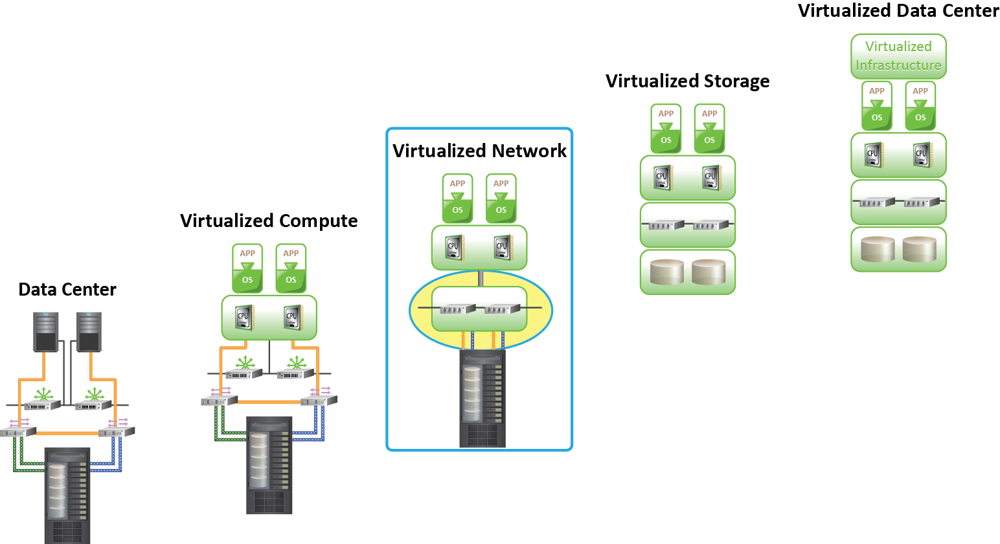
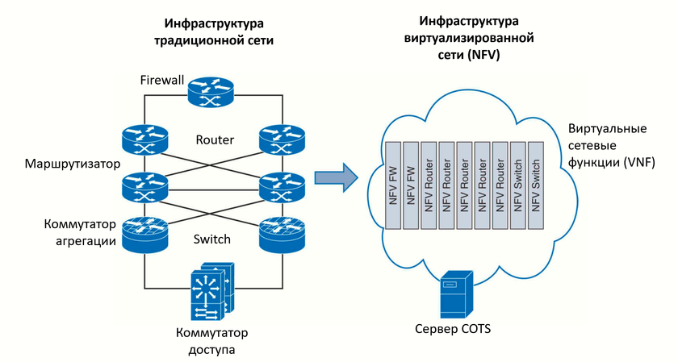
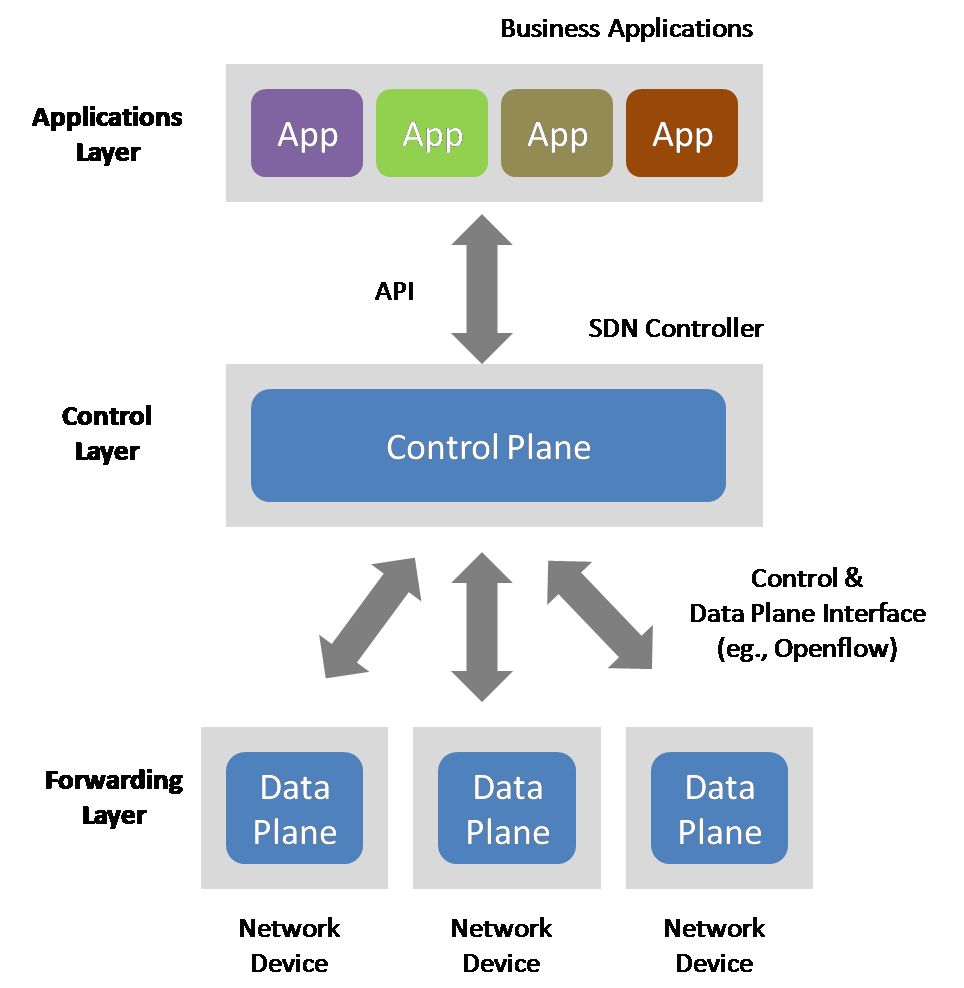
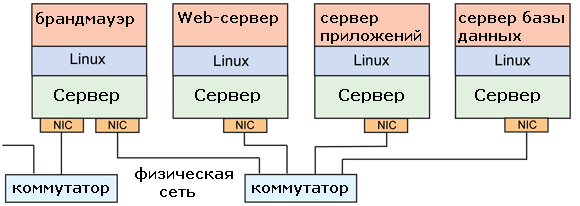
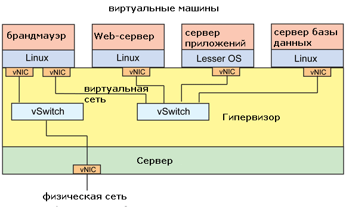
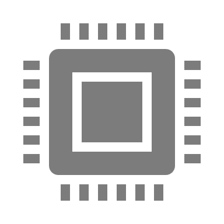
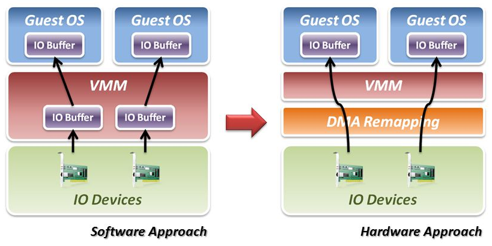
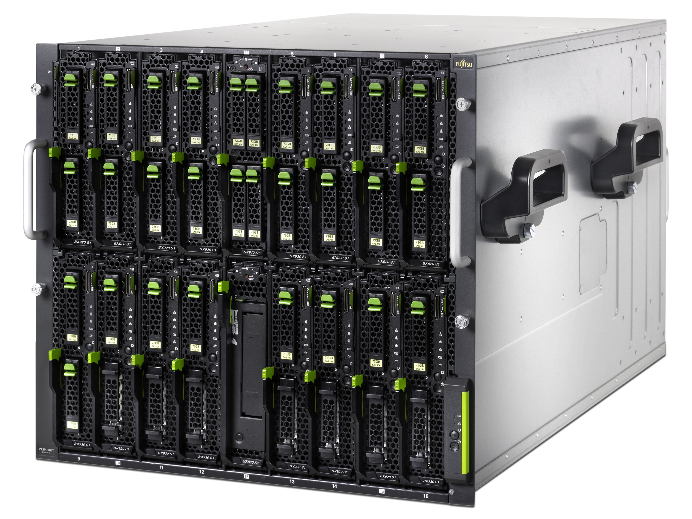
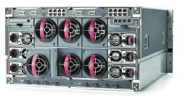

## Классический ЦОД (CDC)
Этапы преобразования CDC в VDC

Классический ЦОД (CDC)

Виртуализация вычислений

(Virtualize Compute)

Виртуализация хранения данных

(Virtualize Storage)

Виртуализация сети

(Virtualize Network)

Виртуализованный ЦОД

(Virtualized Data Center (VDC))

---

## Сетевая виртуализация
Сетевая виртуализация

Процесс логического сегментирования или группировки физических сетей с целью их функционирования как одной или нескольких независимых сетей, называемых «Виртуальные сети» “Virtual Network(s)”.

Виртуальные сети реализуются для разделения сетевых ресурсов

Реализуется взаимодействие между узлами в виртуальной сети без маршрутизации кадров

Усиливает маршрутизацию для взаимодействия между виртуальными сетями

Ограничивает трафик управления, включая ‘Network Broadcast’ от распространения на другие виртуальные сети

Реализует функциональную группировку узлов в виртуальной сети

---

## Сетевая виртуализация
Сетевая виртуализация

Виртуализация – технология, которая позволяет запускать несколько операционных систем на одном физическом сервере

Сетевая виртуализация (NFV – Network Functions Virtualization) расширяет концепцию на все типы сетевых устройств

NFV отделяет программное обеспечение от оборудования, и предоставляет возможность использовать любое оборудование для выполнения на нём специализированных сетевых функций, которые можно менять быстро и в любой момент

---

## Физическая сеть
Физическая сеть

Подразумевает виртуализацию физических сетей и сетей виртуальных машин

Состоит из следующих физических компонент:

Сетевые адаптеры, коммутаторы, маршрутизаторы, мосты, повторители и хабы

Обеспечивает соединение

Между физическими серверами, на которых запущен гипервизор

Между физическими серверами и клиентами

Между физическими серверами и системами хранения

---

## Сеть виртуальных машин (VM Network)
Располагается внутри физических серверов

Состоит из логических коммутаторов, называемых «виртуальные коммутаторы» (“virtual switches”)

Обеспечивает соединения между виртуальными машинами внутри физического сервера

Обеспечивает соединение с ядром гипервизора

Соединяется с физической сетью

Сеть виртуальных машин (VM Network)

---

## Виртуальные сети
Виртуальные сети

VM и физические сети являются основой для создания виртуальных сетей. Например: virtual LAN, virtual SAN

---

## Преимущества сетевой виртуализации
Преимущества сетевой виртуализации

---

## Средства для сетевой виртуализации
Средства для сетевой виртуализации

Операционная система физического коммутатора (Physical switch Operating System (OS))

ОС должна поддерживать функционал сетевой виртуализации

Гипервизор

Использует внутренний функционал для поддержки работы сети и сетевой виртуализации

Для создания виртуального коммутатора и конфигурации виртуальных сетей на нем

Или использует стороннее ПО для обеспечения функционала сети и сетевой виртуализации

Стороннее ПО устанавливается на гипервизор

Стороннее ПО заменяет «родную» (native) сетевую функциональность гипервизора

---

## Компоненты сетевой инфраструктуры
Компоненты сетевой инфраструктуры

Сетевая инфраструктура виртуализованного ЦОД включает в себя компоненты виртуальной и физической сети

Компоненты соединены друг с другом для реализации потока сетевого трафика

---

## Требования для управления сетевым трафиком
Требования для управления сетевым трафиком

Балансировка нагрузки (Load balancing)

Распределяет нагрузку между несколькими IT ресурсами

Предотвращает пере- и недоиспользование ресурсов и оптимизирует производительность

Управление на основание политик (Policy-based management)

Реализует использование политик для распространения трафика между виртуальными машинами и сетевыми соединениями

Реализует использование политик для восстановления трафика между сетевыми соединениями после сбоев

Разделение ресурсов без разногласий (Resource sharing without contention)

Реализует гарантированный уровень сервисов при разделении несколькими виртуальными сетями одного набора физических сетевых ресурсов

Устанавливает приоритет для выделения пропускной способности различным типам трафика

---

## Преимущества сетевой виртуализации
Преимущества сетевой виртуализации

Идея технологии появилась из желания снизить издержки и сделать жизненные циклы программного и аппаратного обеспечения независимыми друг от друга

Использование NFV позволяет выстроить гибкую, стабильно работающую и экономичную архитектуру сети

Наиболее важные преимущества, обеспечиваемые NFV:

Гибкость – можно быстро и легко развернуть сеть и начать ее эксплуатацию

Стоимость – гибкость развертывания ведет к снижению расходов на управление сетью

Масштабируемость – услуги, организованные на базе программного обеспечения позволяют увеличивать или уменьшать объем используемых ресурсов в зависимости от нагрузки

Безопасность – виртуализация сетевых функций обеспечивает безопасность и сохранность данных за счет разделения и изоляции сегментов сети

Быстрое развертывание услуг в другой сети – виртуализация дает возможность развертывать сервисы в любой точке мира

---

## Ключевые техники управления сетевым трафиком
Ключевые техники управления сетевым трафиком

Балансировка клиентской нагрузки: основанная на аппаратной части (Hardware based)

Балансировка клиентской нагрузки: основанная на программной части (Software based)

Контроль бури (Storm control)

Группировка сетевых карт (NIC teaming)

Лимит и доля (Limit and share)

Сглаживание трафика (Traffic shaping)

Управление путями ввода-вывода (Multipathing)

---

## Вклад SDN в виртуализацию сетевых функций
Вклад SDN в виртуализацию сетевых функций

Сетевая виртуализация предоставляет инфраструктуру для прикладных систем. От прикладных систем зависят требования к инфраструктуре

Приложения должны быть защищенными, быстро развертываться и заменяться, быть доступными и устойчивыми к сбоям

Для того, чтобы виртуализация сетевых функций приносила максимальную пользу, необходимо использовать программно-конфигурируемые сети (SDN)

Такой подход предполагает организацию логической сети поверх имеющейся сетевой инфраструктуры

Использование технологий NFV и SDN разделяет сеть на виртуальные слои или сегменты и таким образом упрощает управление каждым из них и сетью в целом

---

## Преимущества сетевого сегментирования
Преимущества сетевого сегментирования

Расширяет возможности NFV за счет лучшей организации передачи трафика

Упрощает управление сетью, работающей со статичными настройками

Дает возможность менять и обновлять функционал сегментов

Упрощается установка и валидация программного обеспечения

Использование сетевого сегментирования снижает риски, связанные с модернизацией сети, поскольку она осуществляется поэтапно в разных сегментах

Если при миграции на новое ПО происходит сбой, можно легко вернуться на старые настройки, и сделать это с минимальным влиянием на качество обслуживания

---

## Виртуализация ввода-вывода
Виртуализация ввода-вывода

Метод, позволяющий упростить управление, снизить затраты и повысить производительность серверов в корпоративной среде

Предполагает использование протоколов абстрагирования физических соединений

Позволяет одной физической карте адаптера выступать в качестве нескольких виртуальных сетевых интерфейсных плат и виртуальных адаптеров шин

Виртуальный ввод-вывод заменяет несколько интерфейсов ввода-вывода на сервере с помощью одного, который обеспечивает общее соединение для всех сетевых соединений

Причиной внедрения является то, что для размещения нескольких приложений виртуальным серверам требуется много сетевой пропускной способности и возможность подключения к нескольким сетям для передачи информации

---

## Преимущества виртуализации ввода-вывода
Преимущества виртуализации ввода-вывода

Позволяет более эффективно использовать интерфейсы за счет консолидации ввода/вывода для одного соединения

Обеспечивает большую гибкость, полное использование и быстрое выделение ресурсов по сравнению с традиционными технологиями

Можно регулировать пропускную способность ввода-вывода для конкретных виртуальных машин, обеспечивая предсказуемую производительность для критически важных приложений

Снижает затраты и обеспечивает упрощенное управление сервером с использованием меньшего количества носителей информации, кабелей и портов коммутатора

Часто приводит к повышению производительности.

Количество физических интерфейсов сокращается, что может снизить количество кабелей в пределах одной серверной стойки более чем на 70 процентов

Виртуализация ввода/вывода повышает плотность ввода/вывода, позволяя большему количеству соединений существовать в пределах одного пространства

---

## Используемые технологии
Используемые технологии

Ключевая технология, лежащая в основе виртуализации – это абстрактное аппаратное обеспечение

Каждая виртуальная машина видит базовое аппаратное обеспечение как систему, используемую в монопольном режиме

Пример – виртуальный сетевой адаптер vNIC.

Эти адаптеры будут видны в ВМ как физические, но в действительности они только предоставляют интерфейс к реальному

Гипервизор может создать виртуальную сеть с виртуальными коммутаторами

Также гипервизор допускает взаимодействие с инфраструктурой физической сети путем подключения физических сетевых адаптеров сервера к своей логической инфраструктуре

---

## Виртуальный коммутатор
Виртуальный коммутатор

Виртуальный коммутатор – это ключевой компонент, необходимый для виртуализации сетевой инфраструктуры

Соединяет виртуальные сетевые адаптеры (vNIC) с физическими сетевыми адаптерами, установленными на сервере, и связывает одни виртуальные сетевые адаптеры с другими для локального взаимодействия в рамках сервера

В различных ОС используются свои решения для виртуализации

virtio – инфраструктура ввода/вывода для Linux, упрощающая и ускоряющая обмен данными между виртуальной машиной и гипервизором

Технология создает стандартизированный транспортный механизм для операций между виртуальной машиной и гипервизором

Его можно использовать для виртуализации блочных устройств, стандартных PCI-устройств, сетевых устройств и т.д

---

## Виртуальный коммутатор
Виртуальный коммутатор

Это наиболее естественный для серверов способ, поскольку в процессоры Intel Xeon встроен контроллер PCI-E и запросы ввода-вывода обрабатываются в кэш-памяти без обращения в оперативную, что повышает производительность операций до 80 %

Коммутатор помимо подключения по шине PCI-E, может иметь интерфейсные модули для подключения к LAN и SAN

Такие интерфейсные модули распознаются драйверами как стандартные адаптеры и полоса пропускания в сети LAN и SAN распределяется динамически

Возможно также выделение полосы, приоритезация и агрегация трафика

---

## Технологии ускорения от Intel
Технологии ускорения от Intel

Существует такой прием ускорения ввода-вывода, как технология VT-d (Virtualization Technology for Directed I/O) от Intel®

Она позволяет изолировать ресурсы ввода-вывода для повышения надежности и безопасности, включая организацию прямого доступа к памяти и прерываниям, связанным с устройством

Эта технология поддерживается как для обычных, так и для виртуальных устройств

Технология Intel® VMDq (Virtual Machine Device Queues) ускоряет сетевой трафик при виртуализации путем встраивания очередей и алгоритмов сортировки в аппаратное обеспечение

Благодаря этой технологии гипервизору для работы требуется меньше процессорных ресурсов

---

## Модульные платформы с виртуализацией ввода-вывода
Модульные платформы с виртуализацией ввода-вывода

Идея виртуализации ввода-вывода нашла применение в модульных серверах (blade), взаимодействующих с «внешним миром» через порты Ethernet и Fibre Channel (FC). Разработчики модульных платформ интегрировали в серверное шасси значительную часть сетевой инфраструктуры вместе с коммутаторами

Они позволяют добиться экономии за счет

меньшего числа компонентов и кабельных соединений, большего количества серверов

совместного управления системами

виртуализации

снижения расходов на электропитание и охлаждение

упрощения развертывания и замены серверов

При виртуализации ввода/вывода создается пул адресов ввода/вывода, автоматически присваиваемых новым серверам или используемых для их реконфигурации с целью балансирования нагрузки или восстановления при отказе

---

## HP Virtual Connect
HP Virtual Connect

HP и IBM разработали собственные оригинальные технологии еще более 10 лет назад

В HP Virtual Connect предусмотрены коммуникационные модули

Можно один раз подсоединить кабели к шасси и назначить параметры подключений серверов к сетям и системам хранения

Настройка серверных профилей заключается в установлении однозначного соответствия между интерфейсами серверов и внешними

Virtual Connect поддерживает связь между серверами без выхода во внешнюю сеть

Серверы можно свободно перемещать, добавлять и восстанавливать, поскольку они не привязаны к сетевой инфраструктуре

ПО для управления способно управлять соединениями для 100 серверных шасси (1600 модульных серверов) с одной консоли

---

## IBM BladeCenter OFM
IBM BladeCenter OFM

ПО OFM работает с системой управления IBM Director и с продуктами независимых производителей (например, Cisco VFrame)

Системный администратор может использовать пул адресов, переназначать их с одного сервера на другой или задавать автоматическое присваивание,

Адреса серверов доступны извне, сетевые администраторы могут применять знакомые среды управления и видеть, что происходит с модульными серверами

При помощи IBM OFM можно присваивать MAC-адреса и WWN для 100 шасси BladeCenter (1400 модульных серверов)

Функция отказоустойчивости при выходе из строя какого-либо сервера (в одном из 100 шасси) запускает резервный в той же конфигурации без перенастройки сетевых адресов

OFM делает это автоматически, присваивая новому серверу адреса отказавшего

---

## Основные понятия, раскрытые в данной лекции:
Итоги

Основные понятия, раскрытые в данной лекции:

Виртуализация сети

Сетевая инфраструктура виртуализованного ЦОД и ее компоненты

Virtual LAN (VLAN), Virtual SAN (VSAN) и их преимущества

основные техники управления сетевым трафиком в виртуализованном ЦОД

Примеры из практики

---

